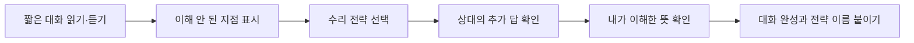

# Conversation Repair Signal Center

> 한국어 서비스명: **대화 수리 신호센터**  
> 문서 상태: 설계 확정 전 검토본 · 구현하지 않음  
> 작성일: 2026-08-26

## 1. 프로젝트 개요

| 항목 | 설계 내용 |
|---|---|
| 대상 | 초등 3~6학년, 수준 선택형 |
| 교과 | 영어 |
| 핵심 질문 | 영어 대화가 잘 이해되지 않을 때 어떤 표현으로 묻고 확인하면 대화를 이어 갈 수 있을까요? |
| 한 차시 권장 시간 | 20~30분 |
| 실행 형태 | 문자 중심, 선택형 로컬 음원을 더할 수 있는 정적 웹앱 |
| 핵심 산출물 | 오해 지점 표시, 수리 표현 선택, 확인된 의미와 대화 완성 |

이 앱은 단어나 문장을 정확히 한 번에 말하는 능력보다, 실제 의사소통에서 생기는 불명확함을 **다시 묻기·구체적으로 묻기·뜻을 확인하기·다르게 말하기**로 수리하는 전략을 연습하게 합니다. 발음 평가나 마이크 녹음 없이도 전체 학습을 완료할 수 있습니다.

## 2. 설계 원칙

- 못 알아들은 상황을 실패가 아니라 대화를 이어 가기 위한 신호로 다룹니다.
- 하나의 문장만 정답으로 강요하지 않고 상황에 맞는 여러 수리 표현을 인정합니다.
- 억양·발음을 자동 채점하지 않아 언어 배경이나 장애에 따른 불이익을 피합니다.
- 3~4학년은 짧은 교실 표현, 5~6학년은 세부 정보와 확인 질문으로 수준을 나눕니다.
- 한국어 설명은 전략 이해를 돕는 보조로 사용하고 실제 선택 표현은 영어로 제공합니다.

## 3. 교육과정 연계와 학습 목표

- `[4영02-10]`: 대화 예절을 지키며 의사소통에 참여하기
- `[6영02-07]`: 일상생활의 담화나 글에서 세부 정보를 묻고 답하기
- `[6영02-09]`: 적절한 매체와 전략을 활용하여 의미를 생성하고 표현하기
- `[6영02-10]`: 자신감을 가지고 협력적으로 의사소통 활동에 참여하기

| 수준 | 학습 목표 |
|---|---|
| 이해 | 다시 묻기와 확인하기가 자연스러운 의사소통 전략임을 압니다. |
| 적용 | 불명확한 정보의 종류에 맞는 수리 표현을 선택합니다. |
| 분석 | 무엇이 빠졌거나 두 가지로 해석되는지 찾아냅니다. |
| 생성 | 수리 표현과 확인 응답을 연결하여 대화를 완성합니다. |

## 4. 기존 앱과의 차별성

| 비교 대상 | 기존 앱의 중심 | 이 앱의 고유 중심 |
|---|---|---|
| 영어 단어 퀴즈 | 어휘 뜻과 철자 회상 | 대화가 막힌 순간의 회복 전략 |
| 사전·단어 학습 앱 | 낱말 정보 탐색 | 상대에게 다시 묻고 의미를 공동 확인 |
| 정보 손실 통신소 | 전달 단계별 원문 변형 추적 | 실시간 대화 속 불명확함을 상호작용으로 수리 |

## 5. 핵심 학습 흐름

## 6. 전략 신호 체계

| 신호 | 목적 | 예시 표현 |
|---|---|---|
| 다시 말해 주세요 | 전체 발화를 놓쳤을 때 | “Could you say that again?” |
| 더 구체적으로 | 대상·시간·장소가 불분명할 때 | “Which one?” / “What time?” |
| 뜻 확인 | 내가 이해한 내용이 맞는지 확인할 때 | “Do you mean the blue box?” |
| 다르게 말하기 | 상대가 내 말을 이해하지 못했을 때 | “Let me say it another way.” |

예시 문구는 학년 수준에 맞게 검수하며, 한 표현을 모든 상황의 만능 정답으로 만들지 않습니다.

## 7. 미션 팩

| 수준 | 상황 | 불명확함 |
|---|---|---|
| 3~4학년 | 교실 물건 건네기 | “그것”에 해당하는 대상이 여러 개 |
| 3~4학년 | 놀이 시간 약속 | 시간 또는 장소를 놓침 |
| 5~6학년 | 모둠 준비물 확인 | 수량과 담당자가 불명확함 |
| 5~6학년 | 길 안내 확인 | 비슷한 장소 이름과 순서 혼동 |
| 5~6학년 | 행사 계획 조정 | 제안과 확정된 내용이 섞임 |

모든 대화는 독창적으로 작성하고 문화적 고정관념이나 특정 억양을 웃음 소재로 쓰지 않습니다.

## 8. 화면 및 정보 구조

| 화면 | 주요 요소 | 학생 행동 |
|---|---|---|
| 신호센터 | 오늘의 전략, 수준 선택, 음성 켜기 | 미션 선택 |
| 대화 관측 | 말풍선, 선택 재생, 문장 번호 | 불명확한 부분 선택 |
| 수리 송신 | 전략 카드와 표현 후보 | 표현 선택·전송 |
| 응답 수신 | 상대의 추가 정보 | 이해 내용 선택 |
| 확인 통화 | 확인 질문 또는 바꿔 말하기 | 대화 완성 |
| 통신 기록 | 사용 전략, 최초·수정 이해 | 다시 하기·교사용 보기 |

## 9. 콘텐츠·판정 모델

- 미션은 `대화`, `불명확한 슬롯`, `허용 전략`, `추가 응답`, `확인 의미`로 구조화합니다.
- 상황에 맞는 복수 표현에는 동일 정답이 아니라 각각 다른 자연스러움 피드백을 제공합니다.
- 정중함이 필요한 상황과 친구 사이의 간단한 표현을 구분합니다.
- 학생이 전체 대사를 외우지 않아도 핵심 슬롯을 확인하면 성공할 수 있게 합니다.
- 음성은 보조 자료일 뿐 텍스트와 항상 동일한 정보를 제공해야 합니다.

## 10. 피드백과 평가

| 평가 요소 | 성취 증거 |
|---|---|
| 문제 인식 | 대상·시간·장소·수량 등 불명확한 부분을 찾음 |
| 전략 선택 | 불명확함의 종류에 맞는 질문을 선택함 |
| 의미 확인 | 상대 응답을 자신의 이해와 다시 연결함 |
| 협력 태도 | 비난하지 않고 정중하게 대화를 이어 감 |

오답 시 정답 문장을 바로 읽어 주지 않고 “어떤 정보가 아직 없나요?”라는 한국어 전략 힌트를 먼저 제공합니다. 결과는 발음 점수나 속도가 아니라 수리 전략의 적절성과 의미 확인 여부로 구성합니다.

## 11. UI·접근성 설계

- 모든 음성에 정확한 대본, 재생·일시 정지·속도 조절을 제공합니다.
- 음성 없이도 같은 학습 결과에 도달할 수 있습니다.
- 필수 버튼 `모호한 부분 찾기`, `확인 질문 보내기`에만 `gi-pulse`를 순차 적용합니다.
- 모션 감소 설정에서는 말풍선 이동 대신 고정 테두리로 발화 순서를 나타냅니다.
- 영문과 한국어 보조 설명의 언어 정보를 마크업하여 스크린 리더 발음을 돕습니다.
- 모바일에서 말풍선이 겹치지 않게 한 열로 배열하고 최소 44px 터치 영역을 사용합니다.

## 12. 기술 구조 설계

- Vite + React + TypeScript 정적 SPA를 권장합니다.
- 대화 콘텐츠, 수리 전략, 판정 규칙, 로컬 음원 메타데이터를 분리합니다.
- 음성을 제공하면 외부 TTS가 아닌 검수된 번들 음원을 우선합니다.
- 마이크, 음성 인식, 로그인, 서버, 광고, 외부 AI API를 사용하지 않습니다.
- 학생의 자유 메모는 자동 평가하거나 전송하지 않습니다.

## 13. 개인정보·포용성 설계

- 학생 음성을 녹음하거나 억양을 평가하지 않습니다.
- 영어 사용 경험이 적은 학생에게 한국어 전략 설명과 표현 듣기를 반복 제공합니다.
- 특정 국가의 영어만 유일한 올바른 억양으로 제시하지 않습니다.
- 오해한 사람을 무례하거나 능력이 부족한 인물로 묘사하지 않습니다.

## 14. MVP 범위

### 포함

- 수준 2단계, 미션 10개
- 네 가지 대화 수리 전략
- 텍스트 기반 완전 학습, 선택적 번들 음성
- 복수 타당 표현과 한국어 전략 피드백

### 제외

- 마이크 녹음·발음 채점·음성 인식
- 자유 대화형 AI 챗봇
- 실제 학생 간 통화·메시지
- 계정, 온라인 순위, 클라우드 기록

## 15. 완료 기준

- 음성을 끄고도 모든 미션을 완료하고 같은 정보를 얻습니다.
- 각 미션은 불명확한 슬롯과 허용 전략이 콘텐츠 검수표에 연결됩니다.
- 하나 이상의 미션에서 복수의 자연스러운 수리 표현을 인정합니다.
- 학생이 수리 질문 뒤 상대의 답을 다시 확인하는 단계까지 수행합니다.
- 키보드, 375px 모바일, 확대 200%, 스크린 리더, 모션 감소 환경을 점검합니다.

## 16. 업데이트 내역 버튼 설계

오른쪽 아래의 작은 `업데이트 내역` 버튼에서 대화 문구, 음원, 교육과정 연결, 접근성 개선 내역을 확인할 수 있게 합니다.

| 날짜 | 구분 | 내역 |
|---|---|---|
| 2026-08-26 | 설계 | 최초 설계 문서 작성 |
| 구현일 입력 예정 | 개발 | MVP 구현과 영어 표현 검수 완료 후 실제 날짜 기록 |

## 17. 이번 문서의 경계

본 문서는 대화 수리 학습 경험의 설계만 다룹니다. 대화 원문·음원 제작 완료, 코드, 테스트, 배포, 서비스 등록은 진행하지 않습니다.
