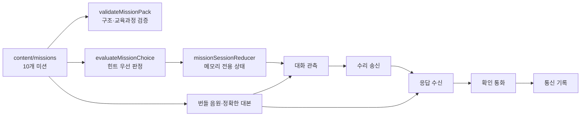

# Conversation Repair Signal Center Implementation Plan

> **For agentic workers:** REQUIRED SUB-SKILL: Use superpowers:subagent-driven-development (recommended) or superpowers:executing-plans to implement this plan task-by-task. Steps use checkbox (`- [ ]`) syntax for tracking.
>
> **Execution boundary:** 이 문서는 구현 절차만 정의한다. 작성 시점에는 소스·설정·테스트 생성, 패키지 설치, Git 초기화, 커밋, 푸시, 배포를 수행하지 않았다. 아래의 모든 명령은 구현 승인을 받은 뒤 프로젝트 루트에서 실행할 항목이다.

**Goal:** 초등 3~6학년 학생이 발음 평가나 녹음 없이 10개 미션에서 불명확한 지점을 찾고, 상황에 맞는 영어 수리 표현을 선택하고, 상대의 추가 답을 자신의 이해와 다시 연결하여 대화를 완성하는 정적 웹앱을 만든다.

**Architecture:** 콘텐츠와 판정 규칙을 TypeScript 데이터로 분리하고, 순수 함수 판정기와 메모리 전용 세션 리듀서가 `신호센터 → 대화 관측 → 수리 송신 → 응답 수신 → 확인 통화 → 통신 기록` 흐름을 통제한다. React 화면은 도메인 인터페이스만 소비하며 네트워크·계정·저장소에 의존하지 않는다. 검수된 번들 음원과 대본은 동일한 콘텐츠 식별자로 연결하고, 음성을 끈 경로를 기준 경로로 유지한다.

**Tech Stack:** Node.js 22.12 이상, npm, Vite, React, TypeScript strict mode, CSS, Vitest, React Testing Library, jest-axe, Playwright Chromium, ESLint

**Spec:** [`2026-08-26-conversation-repair-signal-center-design.md`](</Volumes/ External Drive 256G/Dev2/codex/conversation-repair-signal-center/2026-08-26-conversation-repair-signal-center-design.md>)

## Global Constraints

- 대상은 초등 3~6학년이며 `3-4`, `5-6` 두 수준을 제공하고 한 차시 권장 시간은 20~30분으로 표시한다.
- 학습 성취는 이해·적용·분석·생성 네 수준과 교육과정 코드 `[4영02-10]`, `[6영02-07]`, `[6영02-09]`, `[6영02-10]`에 연결한다.
- 학습의 중심은 어휘·철자 회상이나 정보 전달 변형 추적이 아니라 실시간 대화의 불명확함을 상호작용으로 수리하는 데 둔다.
- 네 전략 식별자는 `repeat`, `specify`, `confirm`, `rephrase`로 고정한다.
- 모든 미션은 `대화`, `불명확한 슬롯`, `허용 전략`, `추가 응답`, `확인 의미`를 포함하고, 동일 미션에서 자연스러운 복수 표현을 서로 다른 피드백으로 인정한다.
- 오답은 정답 문장을 공개하지 않고 먼저 “어떤 정보가 아직 없나요?”에 해당하는 한국어 전략 힌트를 제공한다.
- 결과는 발음·속도 점수가 아니라 문제 인식, 전략 선택, 의미 확인, 협력 태도의 증거로 구성한다.
- 마이크, 녹음, 발음·억양 자동 채점, 음성 인식, 로그인, 서버, 광고, 분석 도구, 외부 AI API, 자유 대화형 챗봇, 실제 학생 간 통화·메시지를 사용하지 않는다.
- 이름과 자유 메모를 받지 않고 현재 학습 기록은 React 메모리에만 보관한다. `localStorage`, `sessionStorage`, 쿠키, 클라우드 기록을 사용하지 않는다.
- 음성은 검수된 동일 출처의 번들 MP3만 사용한다. 모든 음원은 정확한 영문 대본, 재생·일시 정지, `0.75×`, `1×`, `1.25×` 속도 조절을 제공한다.
- 음성 기본값은 꺼짐이며 음원 재생 없이 10개 미션 전체를 완료하고 동일한 의미 정보를 얻어야 한다.
- 모든 영어 문구에는 `lang="en"`, 한국어 설명에는 `lang="ko"`를 적용한다.
- `gi-pulse`는 현재 단계에서 반드시 눌러야 하는 `모호한 부분 찾기`, `확인 질문 보내기` 두 버튼에만 순차적으로 적용한다.
- `prefers-reduced-motion: reduce`에서는 이동·깜빡임을 제거하고 3px 고정 테두리와 정적인 발화 순서 표식을 제공한다.
- 모바일 375px에서 말풍선은 한 열이고 겹침·가로 스크롤이 없어야 하며 모든 상호작용 표면은 최소 44×44 CSS px이다.
- 키보드만으로 전체 학습, 업데이트 내역 열기·닫기, 다시 하기, 신호센터 복귀가 가능해야 한다.
- 미션은 정확히 10개이고 수준별 5개다. 문화적 고정관념, 특정 억양 희화화, 오해한 사람에 대한 비난을 포함하지 않는다.
- 오른쪽 아래에 작은 `업데이트 내역` 버튼을 고정하고 `2026-08-26` 설계 기록, 최초 MVP 개발 기록, 대화·음원 콘텐츠 검수, 교육과정 연결, 접근성 개선 기록을 ISO 날짜와 함께 제공한다.
- `src/`, `scripts/`, `tests/` 아래 단일 `.ts`, `.tsx`, `.css`, `.mjs` 파일은 빈 줄과 주석을 포함해 499줄 이하여야 하며 자동 검사로 보장한다.
- 정적 SPA는 외부 네트워크 요청 없이 빌드 산출물만으로 실행되어야 한다.

## Architecture and Learning Flow



판정기와 리듀서는 React를 import하지 않는 순수 TypeScript 모듈로 둔다. 화면은 선택 식별자를 판정기에 전달하고 `EvaluationResult`를 리듀서에 제출한다. 잘못된 선택은 현재 단계에 머물며 힌트만 노출하고, 수락된 선택만 다음 단계로 진행한다. 통신 기록은 세션 중 파생된 `MissionEvidence`만 표시하며 브라우저 새로고침 시 사라진다.

## Expected File Structure and Responsibilities

모든 경로의 기준은 `/Volumes/ External Drive 256G/Dev2/codex/conversation-repair-signal-center`이다.

```text
.
├── 2026-08-26-conversation-repair-signal-center-design.md   # 확정 설계 근거
├── 2026-08-26-conversation-repair-signal-center-implementation-plan.md
├── package.json / package-lock.json                         # 고정 의존성과 품질 명령
├── index.html / vite.config.ts / tsconfig*.json / eslint.config.js
├── scripts/
│   ├── check-source-lines.mjs                               # 코드 파일 499줄 상한
│   └── verify-audio-assets.mjs                              # 로컬 MP3·대본 매핑 검사
├── public/audio/<mission-id>/
│   ├── dialogue.mp3                                         # 검수된 초기 대화 음원
│   └── response.mp3                                         # 검수된 추가 응답 음원
├── src/
│   ├── main.tsx
│   ├── app/App.tsx
│   ├── app/MissionFlow.tsx
│   ├── content/
│   │   ├── curriculum.ts / strategies.ts / feedback.ts / changelog.ts
│   │   ├── missionValidation.ts / missionRepository.ts
│   │   └── missions/
│   │       ├── grade34-classroom.ts / grade34-recess.ts
│   │       ├── grade56-materials.ts / grade56-directions.ts
│   │       ├── grade56-events.ts / audioManifest.ts / audio-manifest.json / index.ts
│   ├── domain/mission.ts / evaluation.ts / session.ts
│   ├── features/
│   │   ├── center/SignalCenter.tsx / MissionCard.tsx / StrategyLegend.tsx
│   │   ├── observation/DialogueObservation.tsx / DialogueTurnView.tsx
│   │   ├── repair/RepairTransmission.tsx / StrategyCard.tsx
│   │   ├── response/ResponseReception.tsx
│   │   ├── confirmation/ConfirmationCall.tsx
│   │   ├── record/CommunicationRecord.tsx / TeacherSummary.tsx
│   │   ├── audio/AudioPreferenceToggle.tsx / MissionAudioPlayer.tsx / useAudioPlayer.ts
│   │   └── updates/UpdateHistoryButton.tsx / UpdateHistoryDialog.tsx
│   ├── shared/CriticalActionButton.tsx / FeedbackNotice.tsx / LanguageText.tsx
│   ├── styles/index.css / tokens.css / base.css / layout.css / components.css / motion.css
│   └── test/renderWithApp.tsx / missionHarness.tsx / setup.ts
├── tests/
│   ├── e2e/learner-flow.spec.ts / audio-off-parity.spec.ts
│   ├── e2e/accessibility.spec.ts / privacy.spec.ts
│   └── fixtures/accepted-paths.ts
└── docs/qa/
    ├── content-review-matrix.md
    ├── audio-review-matrix.md
    └── acceptance-checklist.md
```

기능별 콘텐츠 파일은 1~3개 미션만 담고, 화면도 단계별 파일로 나눈다. `App.tsx`는 전역 조립, `MissionFlow.tsx`는 단계 라우팅만 담당한다. 콘텐츠 객체·판정 함수·화면 JSX를 한 파일에 합치지 않는다.

## Core Types and Naming Contract

아래 이름은 전 작업에서 그대로 사용한다.

```ts
export type GradeBand = '3-4' | '5-6';
export type CurriculumCode =
  | '[4영02-10]'
  | '[6영02-07]'
  | '[6영02-09]'
  | '[6영02-10]';
export type RepairStrategyId = 'repeat' | 'specify' | 'confirm' | 'rephrase';
export type AmbiguitySlotKind =
  | 'whole-utterance'
  | 'object'
  | 'time'
  | 'place'
  | 'quantity'
  | 'person'
  | 'sequence'
  | 'decision';
export type MissionStage = 'ambiguity' | 'repair' | 'meaning' | 'confirmation';
export type SessionPhase = 'center' | 'observe' | 'repair' | 'response' | 'confirm' | 'record';
export type Naturalness = 'best-fit' | 'works';

export interface DialogueTurn {
  id: string;
  speaker: string;
  textEn: string;
  supportKo?: string;
  obscuredLabelKo?: string;
}

export interface AmbiguityOption {
  id: string;
  turnId: string;
  labelEn: string;
  slotKind: AmbiguitySlotKind;
  accepted: boolean;
  feedbackKo: string;
}

export interface RepairOption {
  id: string;
  strategyId: RepairStrategyId;
  textEn: string;
  naturalness?: Naturalness;
  accepted: boolean;
  feedbackKo: string;
}

export interface MeaningOption {
  id: string;
  labelKo: string;
  accepted: boolean;
  feedbackKo: string;
}

export interface ConfirmationOption {
  id: string;
  mode: 'confirm' | 'rephrase';
  textEn: string;
  accepted: boolean;
  feedbackKo: string;
}

export interface AudioCue {
  id: string;
  src: string;
  mimeType: 'audio/mpeg';
  transcriptEn: string;
}

export interface Mission {
  id: string;
  gradeBand: GradeBand;
  titleKo: string;
  scenarioKo: string;
  politenessContext: 'classroom-polite' | 'peer-brief';
  curriculumCodes: CurriculumCode[];
  learningTargets: Array<'understand' | 'apply' | 'analyze' | 'create'>;
  dialogue: DialogueTurn[];
  ambiguityOptions: AmbiguityOption[];
  allowedStrategyIds: RepairStrategyId[];
  repairOptions: RepairOption[];
  clarifyingResponse: DialogueTurn;
  meaningOptions: MeaningOption[];
  confirmationOptions: ConfirmationOption[];
  audioCues: AudioCue[];
}

export interface EvaluationResult {
  stage: MissionStage;
  optionId: string;
  status: 'accepted' | 'retry';
  feedbackKo: string;
  revealAnswer: false;
  naturalness?: Naturalness;
}
```

선택지 ID는 모든 미션에서 다음 규칙으로 고정한다. `<mission-id>`는 위의 10개 ID 중 하나다.

```text
<mission-id>--ambiguity-target
<mission-id>--ambiguity-distractor-a
<mission-id>--ambiguity-distractor-b
<mission-id>--repair-best
<mission-id>--repair-works
<mission-id>--repair-retry
<mission-id>--meaning-correct
<mission-id>--meaning-retry-a
<mission-id>--meaning-retry-b
<mission-id>--confirmation-correct
<mission-id>--confirmation-retry-a
<mission-id>--confirmation-retry-b
```

## Component Prop Contracts

```ts
export interface MissionCardProps {
  mission: Mission;
  onStart: (missionId: string) => void;
}

export interface AudioPreferenceToggleProps {
  checked: boolean;
  onChange: (checked: boolean) => void;
}

export interface LanguageTextProps {
  language: 'en' | 'ko';
  as?: 'span' | 'p';
  children: ReactNode;
}

export interface DialogueTurnViewProps {
  turn: DialogueTurn;
  sequence: number;
}

export interface FeedbackNoticeProps {
  result: EvaluationResult | null;
}

export interface StrategyCardProps {
  strategy: RepairStrategy;
  politenessContext: Mission['politenessContext'];
}

export interface TeacherSummaryProps {
  mission: Mission;
  evidence: MissionEvidence;
}

export interface UpdateHistoryDialogProps {
  records: readonly ChangeRecord[];
  onClose: () => void;
}
```

## Exact Mission Content Contract

각 미션은 아래 원문과 의미를 사용한다. 각 `수락 표현`의 첫 표현은 `best-fit`, 두 번째 표현은 `works`이며 서로 다른 한국어 피드백을 가진다. `재시도 표현`은 정답 문장을 노출하지 않는 힌트를 반환한다. 각 미션의 의미 선택과 확인 선택은 수락 1개, 재시도 2개로 구성한다.

`g34-recess-rephrase`의 세 `ConfirmationOption.mode`는 `rephrase`이고, 나머지 9개 미션의 확인 선택은 모두 `confirm`이다.

| ID | 수준·상황 | 대화의 불명확함 | 수락 표현 2개 | 추가 응답 | 최종 확인 |
|---|---|---|---|---|---|
| `g34-classroom-box` | 3~4·교실 물건 | Teacher: “Please put the crayons in that box.”의 `that box` (`object`) | “Which box?” / “Do you mean the blue box?” | “The blue box by the window.” | “So, I’ll put the crayons in the blue box by the window.” |
| `g34-classroom-pencil` | 3~4·교실 물건 | Partner: “Can you pass me that one?”의 `that one` (`object`) | “Which one?” / “Do you mean the long pencil?” | “The short pencil, please.” | “Okay, you mean the short pencil.” |
| `g34-recess-place` | 3~4·놀이 약속 | Partner: “Let’s meet there after lunch.”의 `there` (`place`) | “Where should we meet?” / “Do you mean by the swings?” | “At the bench beside the playground gate.” | “We’ll meet at the bench beside the playground gate.” |
| `g34-recess-time` | 3~4·놀이 약속 | 종소리 때문에 전체 문장을 놓친 상황 (`whole-utterance`) | “Could you say that again?” / “Sorry, can you repeat that?” | “Let’s start the game at one thirty.” | “The game starts at one thirty, right?” |
| `g34-recess-rephrase` | 3~4·놀이 약속 | 내가 “Let’s do it over there.”라고 말한 뒤 상대가 이해하지 못한 상황 (`place`) | “Let me say it another way. Let’s draw with chalk beside the hopscotch grid.” / “I mean the place beside the hopscotch grid.” | “Okay, beside the hopscotch grid.” | “Right, I mean the place beside the hopscotch grid.” |
| `g56-materials-quantity` | 5~6·모둠 준비물 | Leader: “Please bring some sheets of poster paper tomorrow.”의 `some sheets` (`quantity`) | “How many sheets of poster paper should I bring?” / “How much poster paper should I bring?” | “Please bring four sheets.” | “I’ll bring four sheets of poster paper tomorrow.” |
| `g56-materials-person` | 5~6·모둠 준비물 | Leader: “Minseo has the tape. We still need the markers.”에서 담당자 누락 (`person`) | “Who will bring the markers?” / “Do you mean you will bring the markers?” | “I will bring two packs of markers.” | “You’ll bring two packs of markers, and Minseo has the tape.” |
| `g56-directions-place` | 5~6·길 안내 | Guide: “After the bank, turn toward the hall.”의 `the hall` (`place`) | “Which hall do you mean?” / “Do you mean the music hall?” | “The music hall across from the bakery.” | “I turn toward the music hall across from the bakery.” |
| `g56-directions-sequence` | 5~6·길 안내 | Guide: “Walk past the pharmacy and cross at the second light. Then take the next turn.”의 다음 순서 (`sequence`) | “What should I do after the second traffic light?” / “Do I turn right after the second light?” | “Turn right. The library is the first building on the left.” | “After the second light, I turn right and find the library on the left.” |
| `g56-event-decision` | 5~6·행사 계획 | “We could meet at two in the library, or at three in the art room. I think the second plan works better.”에서 제안과 확정 혼재 (`decision`) | “Do you mean we’re meeting at three in the art room?” / “Is the final plan three o’clock in the art room?” | “Yes. Three in the art room is the final plan.” | “Got it. The final plan is three o’clock in the art room.” |

재시도 표현과 힌트는 다음처럼 고정한다.

| 미션 ID | 재시도 표현 | 힌트의 핵심 문장 |
|---|---|---|
| `g34-classroom-box` | “Could you say that again?” | “말은 들었지만 어느 상자인지가 아직 분명하지 않아요.” |
| `g34-classroom-pencil` | “What time?” | “시간이 아니라 어떤 물건인지 찾아보세요.” |
| `g34-recess-place` | “What time?” | “만날 때는 알지만 만날 장소가 아직 없어요.” |
| `g34-recess-time` | “Which one?” | “문장 전체를 놓쳤을 때 쓰는 다시 말하기 신호를 찾아보세요.” |
| `g34-recess-rephrase` | “Could you say that again?” | “상대가 내 말을 이해하지 못했으니 내 뜻을 다른 말로 풀어보세요.” |
| `g56-materials-quantity` | “Who will bring it?” | “담당자가 아니라 필요한 종이 수량을 확인해 보세요.” |
| `g56-materials-person` | “How many markers?” | “수량보다 누가 맡는지가 아직 정해지지 않았어요.” |
| `g56-directions-place` | “Could you say that again?” | “안내는 들었지만 어느 장소인지 구체화해야 해요.” |
| `g56-directions-sequence` | “Where is the pharmacy?” | “약국 뒤에 어떤 순서로 움직이는지 확인해 보세요.” |
| `g56-event-decision` | “Could you say that again?” | “두 제안 중 무엇이 최종 결정인지 확인해 보세요.” |

수락 표현의 자연스러움 피드백도 데이터에 아래 문장 그대로 저장한다.

| 미션 ID | `best-fit` 피드백 | `works` 피드백 |
|---|---|---|
| `g34-classroom-box` | “어느 상자인지 직접 물어 상황에 꼭 맞는 표현이에요.” | “가능한 상자를 정중하게 확인해 대화를 이어 갔어요.” |
| `g34-classroom-pencil` | “어떤 연필인지 바로 물어 필요한 정보를 찾았어요.” | “가능한 연필을 정중하게 확인했어요.” |
| `g34-recess-place` | “빠진 장소를 직접 물어 약속을 분명하게 했어요.” | “떠올린 장소가 맞는지 확인해 대화를 이어 갔어요.” |
| `g34-recess-time` | “문장 전체를 놓친 상황에 꼭 맞는 다시 말하기 표현이에요.” | “미안함을 덧붙여 정중하게 반복을 요청했어요.” |
| `g34-recess-rephrase` | “장소를 구체적으로 넣어 내 뜻을 분명하게 바꾸어 말했어요.” | “핵심 장소를 다른 말로 풀어 상대가 이해할 수 있게 했어요.” |
| `g56-materials-quantity` | “필요한 종이 수량을 정확히 물었어요.” | “묻는 범위가 넓지만 필요한 수량을 확인할 수 있어요.” |
| `g56-materials-person` | “빠진 담당자를 직접 물어 역할을 분명하게 했어요.” | “가능한 담당자가 맞는지 확인했어요.” |
| `g56-directions-place` | “어느 홀인지 직접 물어 장소를 구체화했어요.” | “가능한 홀 이름을 확인해 길 안내를 이어 갔어요.” |
| `g56-directions-sequence` | “두 번째 신호등 뒤의 순서를 직접 물었어요.” | “예상한 방향이 맞는지 구체적으로 확인했어요.” |
| `g56-event-decision` | “두 제안 중 최종 시간과 장소를 함께 확인했어요.” | “최종 계획의 시간과 장소를 다시 묻는 자연스러운 표현이에요.” |

수락 meaning option의 `labelKo`는 미션 순서대로 `창가에 있는 파란 상자`, `짧은 연필`, `운동장 문 옆 벤치`, `오후 1시 30분`, `사방치기 칸 옆`, `포스터 종이 네 장`, `상대가 마커 두 묶음, 민서가 테이프 담당`, `빵집 맞은편 음악당`, `두 번째 신호등 뒤 우회전, 왼쪽 첫 건물 도서관`, `오후 3시 미술실이 최종 계획`으로 고정한다.

미션 제목·상황, 불명확함 선택지, 의미 선택지, 확인 선택지는 아래 값을 그대로 사용한다. 각 세 칸은 `수락값 / 재시도 A / 재시도 B` 순서다.

| 미션 ID | `titleKo`와 `scenarioKo` | 불명확함 선택 `labelEn` | 의미 선택 `labelKo` | 확인 선택 `textEn` |
|---|---|---|---|---|
| `g34-classroom-box` | `어느 상자` · 교실에 빨간 상자와 파란 상자가 함께 있습니다. | `that box` / `the crayons` / `Please put` | `창가에 있는 파란 상자` / `문 옆 빨간 상자` / `책상 아래 파란 상자` | `So, I’ll put the crayons in the blue box by the window.` / `So, I’ll put the crayons in the red box by the door.` / `So, I’ll put the crayons in the blue box under the desk.` |
| `g34-classroom-pencil` | `어떤 연필` · 책상에 긴 연필과 짧은 연필이 있습니다. | `that one` / `pass me` / `Can you` | `짧은 연필` / `긴 연필` / `짧은 자` | `Okay, you mean the short pencil.` / `Okay, you mean the long pencil.` / `Okay, you mean the short ruler.` |
| `g34-recess-place` | `약속 장소` · 놀이터에 그네, 운동장 문, 벤치가 보입니다. | `there` / `after lunch` / `Let’s meet` | `운동장 문 옆 벤치` / `그네 옆` / `교실 문 앞` | `We’ll meet at the bench beside the playground gate.` / `We’ll meet by the swings.` / `We’ll meet by the classroom door.` |
| `g34-recess-time` | `놀이 시작 시간` · 종이 울려 친구의 문장 전체를 놓쳤습니다. | `the whole sentence` / `the bell sound` / `the speaker` | `오후 1시 30분` / `오후 1시` / `오후 2시 30분` | `The game starts at one thirty, right?` / `The game starts at one, right?` / `The game starts at two thirty, right?` |
| `g34-recess-rephrase` | `장소를 다시 설명하기` · 친구가 “저기”가 어디인지 이해하지 못했습니다. | `over there` / `Let’s` / `do it` | `사방치기 칸 옆` / `큰 나무 아래` / `그네 옆` | `Right, I mean the place beside the hopscotch grid.` / `Right, I mean the place under the big tree.` / `Right, I mean the place beside the swings.` |
| `g56-materials-quantity` | `준비물 수량` · 모둠 포스터에 필요한 종이 수량을 정합니다. | `some sheets` / `poster paper` / `tomorrow` | `포스터 종이 네 장` / `포스터 종이 두 장` / `포스터 종이 네 묶음` | `I’ll bring four sheets of poster paper tomorrow.` / `I’ll bring two sheets of poster paper tomorrow.` / `I’ll bring four packs of poster paper tomorrow.` |
| `g56-materials-person` | `준비물 담당자` · 테이프와 마커를 누가 가져올지 확인합니다. | `who brings the markers` / `Minseo has the tape` / `the tape` | `상대가 마커 두 묶음, 민서가 테이프 담당` / `민서가 마커와 테이프 모두 담당` / `상대가 테이프, 민서가 마커 담당` | `You’ll bring two packs of markers, and Minseo has the tape.` / `Minseo will bring the markers and the tape.` / `You’ll bring the tape, and Minseo has the markers.` |
| `g56-directions-place` | `비슷한 장소 이름` · 길 안내에 체육관과 음악당이 함께 나옵니다. | `the hall` / `the bank` / `After` | `빵집 맞은편 음악당` / `빵집 맞은편 체육관` / `은행 옆 음악당` | `I turn toward the music hall across from the bakery.` / `I turn toward the sports hall across from the bakery.` / `I turn toward the music hall beside the bank.` |
| `g56-directions-sequence` | `길 안내 순서` · 약국과 두 번째 신호등 뒤의 이동 순서를 확인합니다. | `the next turn` / `the pharmacy` / `the second light` | `두 번째 신호등 뒤 우회전, 왼쪽 첫 건물 도서관` / `두 번째 신호등 뒤 좌회전` / `우회전 뒤 왼쪽 두 번째 건물 도서관` | `After the second light, I turn right and find the library on the left.` / `After the second light, I turn left.` / `After the second light, I turn right and pass the library on the right.` |
| `g56-event-decision` | `행사 최종 계획` · 두 시간·장소 제안 가운데 확정된 계획을 확인합니다. | `the final time and place` / `the library` / `the art room` | `오후 3시 미술실이 최종 계획` / `오후 2시 도서관이 최종 계획` / `오후 3시 도서관이 최종 계획` | `Got it. The final plan is three o’clock in the art room.` / `Got it. The final plan is two o’clock in the library.` / `Got it. The final plan is three o’clock in the library.` |

두 ambiguity 재시도 선택의 `feedbackKo`는 `AMBIGUITY_RETRY_FEEDBACK_KO`를 사용한다. meaning과 confirmation 재시도는 Task 3의 `createMeaningRetryFeedback`, `createConfirmationRetryFeedback`이 슬롯별 완성 문장을 반환하게 하여 미완성 문구가 콘텐츠 데이터에 들어가지 않게 한다.

의미 선택의 수락값은 각 표의 `추가 응답`에 담긴 정보와 정확히 일치한다. 두 재시도 값은 같은 상황의 미확정 제안과 다른 슬롯 값을 사용한다. 확인 선택의 수락값은 `최종 확인` 문장이고, 두 재시도 값은 추가 응답의 핵심 슬롯 하나를 바꾸거나 생략한다.

---

### Task 1: Project Foundation and Executable Quality Harness

**Files:**
- Track unchanged: `2026-08-26-conversation-repair-signal-center-design.md`
- Track unchanged: `2026-08-26-conversation-repair-signal-center-implementation-plan.md`
- Create: `.gitignore`
- Create: `.nvmrc`
- Create: `package.json`
- Create: `package-lock.json`
- Create: `index.html`
- Create: `vite.config.ts`
- Create: `tsconfig.json`
- Create: `tsconfig.app.json`
- Create: `tsconfig.node.json`
- Create: `eslint.config.js`
- Create: `src/main.tsx`
- Create: `src/app/App.tsx`
- Create: `src/app/App.smoke.test.tsx`
- Create: `src/test/setup.ts`
- Create: `src/test/renderWithApp.tsx`
- Create: `src/styles/index.css`
- Create: `scripts/check-source-lines.mjs`

**Interfaces:**
- Consumes: 설계 문서와 Global Constraints.
- Produces: `App(): JSX.Element`, `renderWithUser(ui: ReactElement)`, `npm run dev`, `npm run test:run`, `npm run typecheck`, `npm run lint`, `npm run check:size`, `npm run build`.

- [ ] **Step 1: 향후 저장소와 고정 실행 환경을 초기화한다**

Run:

```bash
git init -b main
node --version
npm --version
```

Expected: Git은 빈 `main` 저장소를 만들고, Node 출력은 `v22.12.0` 이상이다. 실제 Node 전체 버전을 `.nvmrc`에 기록한다.

- [ ] **Step 2: 프로젝트와 테스트 의존성을 설치한다**

Run:

```bash
npm install react@latest react-dom@latest
npm install --save-dev typescript@latest vite@latest @vitejs/plugin-react@latest vitest@latest jsdom@latest @testing-library/react@latest @testing-library/jest-dom@latest @testing-library/user-event@latest jest-axe@latest axe-core@latest @axe-core/playwright@latest @playwright/test@latest eslint@latest typescript-eslint@latest eslint-plugin-react-hooks@latest eslint-plugin-react-refresh@latest
npx playwright install chromium
```

Expected: `package-lock.json`이 생성되고 모든 명령이 종료 코드 0으로 끝난다. `package.json`의 스크립트는 아래 이름을 정확히 사용한다.

```json
{
  "scripts": {
    "dev": "vite",
    "build": "tsc -b && vite build",
    "preview": "vite preview",
    "lint": "eslint .",
    "typecheck": "tsc -b --pretty false",
    "test": "vitest",
    "test:run": "vitest run",
    "test:e2e": "playwright test",
    "check:size": "node scripts/check-source-lines.mjs",
    "verify": "npm run lint && npm run typecheck && npm run test:run && npm run check:size && npm run build"
  }
}
```

- [ ] **Step 3: 실패하는 앱 스모크 테스트를 작성한다**

```tsx
it('renders the Korean service name and the learning promise', () => {
  render(<App />);
  expect(screen.getByRole('heading', { name: '대화 수리 신호센터' })).toBeVisible();
  expect(screen.getByText('못 알아들은 순간은 대화를 이어 가는 신호예요.')).toBeVisible();
});
```

- [ ] **Step 4: 실패를 확인한다**

Run: `npm run test:run -- src/app/App.smoke.test.tsx`

Expected: `src/app/App.tsx` 또는 필수 문구가 없어서 FAIL한다.

- [ ] **Step 5: 최소 앱 셸과 테스트 설정을 구현한다**

```tsx
export function App() {
  return (
    <main id="main-content">
      <h1>대화 수리 신호센터</h1>
      <p>못 알아들은 순간은 대화를 이어 가는 신호예요.</p>
    </main>
  );
}
```

`vite.config.ts`는 React 플러그인, `base: './'`, Vitest `environment: 'jsdom'`, `setupFiles: './src/test/setup.ts'`를 설정한다. `tsconfig.app.json`은 `strict`, `noUncheckedIndexedAccess`, `exactOptionalPropertyTypes`, `resolveJsonModule`을 켠다. `check-source-lines.mjs`는 `src`, `scripts`, `tests`의 `.ts`, `.tsx`, `.css`, `.mjs`를 순회해 500줄 이상인 파일 경로와 줄 수를 출력하고 종료 코드 1을 반환한다.

`renderWithApp.tsx`의 테스트 헬퍼는 아래 반환 계약을 사용한다.

```tsx
export function renderWithUser(ui: ReactElement) {
  return { user: userEvent.setup(), ...render(ui) };
}
```

- [ ] **Step 6: 기초 품질 명령을 통과시킨다**

Run:

```bash
npm run test:run -- src/app/App.smoke.test.tsx
npm run typecheck
npm run lint
npm run check:size
npm run build
```

Expected: 스모크 테스트 1개 PASS, 타입 오류 0개, ESLint 오류 0개, 모든 코드 파일 499줄 이하, `dist/index.html` 생성.

- [ ] **Step 7: 기초 커밋을 만든다**

```bash
git add 2026-08-26-conversation-repair-signal-center-design.md 2026-08-26-conversation-repair-signal-center-implementation-plan.md .gitignore .nvmrc package.json package-lock.json index.html vite.config.ts tsconfig.json tsconfig.app.json tsconfig.node.json eslint.config.js src/main.tsx src/app/App.tsx src/app/App.smoke.test.tsx src/test src/styles/index.css scripts/check-source-lines.mjs
git commit -m "chore: scaffold conversation repair signal center"
```

Expected: 최초 커밋이 생성되고 `git status --short`는 비어 있다.

### Task 2: Domain Contracts and Compile-Time Boundaries

**Files:**
- Create: `src/domain/mission.ts`
- Create: `src/domain/session.ts`
- Create: `src/domain/mission-contract.test.ts`

**Interfaces:**
- Consumes: Task 1의 TypeScript strict 설정.
- Produces: `GradeBand`, `CurriculumCode`, `RepairStrategyId`, `AmbiguitySlotKind`, `MissionStage`, `SessionPhase`, `Naturalness`, `DialogueTurn`, `AmbiguityOption`, `RepairOption`, `MeaningOption`, `ConfirmationOption`, `AudioCue`, `Mission`, `EvaluationResult`, `MissionEvidence`, `MissionSessionState`, `MissionSessionAction`.

- [ ] **Step 1: 도메인 계약을 요구하는 실패 테스트를 작성한다**

```ts
const fixture = {
  id: 'contract-fixture',
  gradeBand: '3-4',
  allowedStrategyIds: ['specify'],
  audioCues: [],
} satisfies Pick<Mission, 'id' | 'gradeBand' | 'allowedStrategyIds' | 'audioCues'>;

it('keeps mission identifiers and strategy identifiers explicit', () => {
  expect(fixture.gradeBand).toBe('3-4');
  expect(fixture.allowedStrategyIds).toEqual(['specify']);
});
```

- [ ] **Step 2: 타입 부재로 실패하는지 확인한다**

Run: `npm run test:run -- src/domain/mission-contract.test.ts && npm run typecheck`

Expected: `Mission` 등 계약이 export되지 않아 첫 실행은 FAIL한다.

- [ ] **Step 3: Core Types and Naming Contract의 타입을 구현한다**

`src/domain/mission.ts`에는 위 계약을 그대로 작성한다. `src/domain/session.ts`에는 다음 세션 계약을 추가한다.

```ts
export interface AttemptRecord {
  stage: MissionStage;
  optionId: string;
  status: EvaluationResult['status'];
}

export interface MissionEvidence {
  missionId: string;
  identifiedSlotKind: AmbiguitySlotKind;
  repairStrategyId: RepairStrategyId;
  firstMeaningOptionId: string;
  confirmedMeaningOptionId: string;
  meaningConfirmed: true;
  collaborationFeedbackKo: string;
  attempts: AttemptRecord[];
}

export interface MissionSessionState {
  phase: SessionPhase;
  missionId: string | null;
  selectedOptionIds: Partial<Record<MissionStage, string>>;
  acceptedResults: Partial<Record<MissionStage, EvaluationResult>>;
  latestResult: EvaluationResult | null;
  attempts: AttemptRecord[];
  firstMeaningOptionId: string | null;
  evidence: MissionEvidence | null;
}

export type MissionSessionAction =
  | { type: 'mission.started'; missionId: string }
  | { type: 'choice.selected'; stage: MissionStage; optionId: string }
  | { type: 'choice.submitted'; mission: Mission; result: EvaluationResult }
  | { type: 'mission.restarted' }
  | { type: 'center.returned' };
```

- [ ] **Step 4: 타입과 테스트를 통과시킨다**

Run:

```bash
npm run test:run -- src/domain/mission-contract.test.ts
npm run typecheck
npm run check:size
```

Expected: 도메인 계약 테스트 PASS, 타입 오류 0개, 각 도메인 파일 499줄 이하.

- [ ] **Step 5: 도메인 계약을 커밋한다**

```bash
git add src/domain/mission.ts src/domain/session.ts src/domain/mission-contract.test.ts
git commit -m "feat: define conversation repair domain contracts"
```

Expected: 계약 파일과 테스트만 한 커밋에 포함된다.

### Task 3: Strategy Catalog, Curriculum Links, and Mission Validation

**Files:**
- Create: `src/content/strategies.ts`
- Create: `src/content/curriculum.ts`
- Create: `src/content/feedback.ts`
- Create: `src/content/missionValidation.ts`
- Create: `src/content/missionValidation.test.ts`

**Interfaces:**
- Consumes: `Mission`, `RepairStrategyId`, `CurriculumCode` from `src/domain/mission.ts`.
- Produces: `RepairStrategy`, `REPAIR_STRATEGIES`, `CurriculumLink`, `CURRICULUM_LINKS`, `SLOT_LABELS_KO`, `AMBIGUITY_RETRY_FEEDBACK_KO`, `createMeaningRetryFeedback(slotKind: AmbiguitySlotKind): string`, `createConfirmationRetryFeedback(slotKind: AmbiguitySlotKind): string`, `ValidationIssue`, `ContentValidationReport`, `validateMissionPack(missions: readonly Mission[]): ContentValidationReport`.

- [ ] **Step 1: 구조·범위 오류를 드러내는 실패 테스트를 작성한다**

```ts
it('rejects a pack without ten missions and all four strategies', () => {
  const report = validateMissionPack([makeValidMission({ id: 'only-one' })]);
  expect(report.valid).toBe(false);
  expect(report.issues.map(({ code }) => code)).toEqual(
    expect.arrayContaining(['PACK_COUNT', 'GRADE_BAND_COUNT', 'STRATEGY_COVERAGE']),
  );
});

it('rejects accepted repair options outside allowed strategies', () => {
  const mission = makeValidMission({
    allowedStrategyIds: ['specify'],
    repairOptions: [
      acceptedRepair({ id: 'wrong-contract', strategyId: 'repeat' }),
      acceptedRepair({ id: 'second-contract', strategyId: 'specify', naturalness: 'works' }),
    ],
  });
  expect(validateMissionPack(makeTenMissionPack(mission)).issues).toContainEqual(
    expect.objectContaining({ missionId: mission.id, code: 'REPAIR_NOT_ALLOWED' }),
  );
});

it('builds complete Korean hints from an exact slot label', () => {
  expect(createMeaningRetryFeedback('quantity')).toBe(
    '어떤 정보가 아직 없나요? 상대의 추가 답에서 새로 확인된 수량 정보를 다시 찾아보세요.',
  );
  expect(createConfirmationRetryFeedback('decision')).toBe(
    '어떤 정보가 아직 없나요? 확인 문장에서 최종 결정 정보가 바뀌거나 빠졌어요.',
  );
});
```

테스트 안의 `makeValidMission`, `acceptedRepair`, `makeTenMissionPack`는 `src/content/missionValidation.test.ts` 내부 전용 함수로 완전한 `Mission` 객체를 반환한다.

- [ ] **Step 2: 검증기 부재로 실패하는지 확인한다**

Run: `npm run test:run -- src/content/missionValidation.test.ts`

Expected: `validateMissionPack`과 카탈로그 export가 없어서 FAIL한다.

- [ ] **Step 3: 네 전략과 교육과정 연결을 구현한다**

```ts
export interface RepairStrategy {
  id: RepairStrategyId;
  labelKo: string;
  purposeKo: string;
  examplesEn: readonly string[];
}

export const REPAIR_STRATEGIES = [
  { id: 'repeat', labelKo: '다시 말해 주세요', purposeKo: '전체 발화를 놓쳤을 때', examplesEn: ['Could you say that again?'] },
  { id: 'specify', labelKo: '더 구체적으로', purposeKo: '대상·시간·장소·수량·담당·순서가 불분명할 때', examplesEn: ['Which one?', 'What time?'] },
  { id: 'confirm', labelKo: '뜻 확인', purposeKo: '내가 이해한 내용이 맞는지 확인할 때', examplesEn: ['Do you mean the blue box?'] },
  { id: 'rephrase', labelKo: '다르게 말하기', purposeKo: '상대가 내 말을 이해하지 못했을 때', examplesEn: ['Let me say it another way.'] },
] as const satisfies readonly RepairStrategy[];
```

`CURRICULUM_LINKS`는 네 교육과정 코드마다 설계 문서의 성취 내용을 `descriptionKo`로 보존하고, `evidenceStages`를 `MissionStage[]`로 연결한다. `[4영02-10]`은 `repair`, `confirmation`; `[6영02-07]`은 `ambiguity`, `meaning`; `[6영02-09]`는 네 단계 전체; `[6영02-10]`은 `repair`, `confirmation`에 연결한다.

```ts
export const SLOT_LABELS_KO: Record<AmbiguitySlotKind, string> = {
  'whole-utterance': '문장 전체', object: '대상', time: '시간', place: '장소',
  quantity: '수량', person: '담당자', sequence: '순서', decision: '최종 결정',
};

export const AMBIGUITY_RETRY_FEEDBACK_KO =
  '어떤 정보가 아직 없나요? 대화에서 두 가지로 해석되거나 놓친 부분을 다시 찾아보세요.';

export const createMeaningRetryFeedback = (slotKind: AmbiguitySlotKind) =>
  `어떤 정보가 아직 없나요? 상대의 추가 답에서 새로 확인된 ${SLOT_LABELS_KO[slotKind]} 정보를 다시 찾아보세요.`;

export const createConfirmationRetryFeedback = (slotKind: AmbiguitySlotKind) =>
  `어떤 정보가 아직 없나요? 확인 문장에서 ${SLOT_LABELS_KO[slotKind]} 정보가 바뀌거나 빠졌어요.`;
```

- [ ] **Step 4: 정확한 검증 규칙을 최소 구현한다**

```ts
export type ValidationCode =
  | 'PACK_COUNT'
  | 'DUPLICATE_ID'
  | 'GRADE_BAND_COUNT'
  | 'STRATEGY_COVERAGE'
  | 'MISSING_STAGE_OPTION'
  | 'REPAIR_NOT_ALLOWED'
  | 'MULTIPLE_EXPRESSION_REQUIRED'
  | 'DUPLICATE_FEEDBACK'
  | 'CURRICULUM_LINK_REQUIRED'
  | 'LEARNING_TARGET_REQUIRED'
  | 'EXTERNAL_AUDIO_URL'
  | 'TRANSCRIPT_REQUIRED';

export interface ValidationIssue {
  missionId: string | 'pack';
  code: ValidationCode;
  field: string;
  messageKo: string;
}

export interface ContentValidationReport {
  valid: boolean;
  issues: ValidationIssue[];
  coverage: {
    missionCount: number;
    gradeBandCounts: Record<GradeBand, number>;
    strategyIds: RepairStrategyId[];
    missionsWithMultipleAcceptedRepairs: string[];
  };
}
```

`validateMissionPack`은 정확히 10개·수준별 5개·고유 ID·네 전략 전체 사용·단계별 수락 선택 존재·수락 수리 표현 2개 이상·서로 다른 자연스러움 피드백·허용 전략 일치·교육과정 코드 1개 이상·네 학습 목표 전체 연결·음원 경로 `audio/` 시작·비어 있지 않은 대본을 검사한다. 음원 배열이 빈 미션은 Task 11 전까지 허용하되, 배열에 항목이 있으면 로컬 경로와 대본 규칙을 즉시 적용한다.

- [ ] **Step 5: 검증 테스트를 통과시킨다**

Run:

```bash
npm run test:run -- src/content/missionValidation.test.ts
npm run typecheck
npm run check:size
```

Expected: 잘못된 팩별 오류 코드 테스트가 모두 PASS하고 타입 오류가 없다.

- [ ] **Step 6: 전략·교육과정·검증기를 커밋한다**

```bash
git add src/content/strategies.ts src/content/curriculum.ts src/content/feedback.ts src/content/missionValidation.ts src/content/missionValidation.test.ts
git commit -m "feat: validate repair strategy mission contracts"
```

Expected: 콘텐츠 데이터보다 먼저 검증 경계가 독립 커밋으로 남는다.

### Task 4: Ten-Mission Content Pack and Review Matrix

**Files:**
- Create: `src/content/missions/grade34-classroom.ts`
- Create: `src/content/missions/grade34-recess.ts`
- Create: `src/content/missions/grade56-materials.ts`
- Create: `src/content/missions/grade56-directions.ts`
- Create: `src/content/missions/grade56-events.ts`
- Create: `src/content/missions/index.ts`
- Create: `src/content/missionRepository.ts`
- Create: `src/content/missions/missions.test.ts`
- Create: `docs/qa/content-review-matrix.md`

**Interfaces:**
- Consumes: `Mission`, `GradeBand`, `REPAIR_STRATEGIES`, `validateMissionPack`.
- Produces: `MISSIONS: readonly Mission[]`, `getMissionById(id: string): Mission`, `getMissionsByGradeBand(gradeBand: GradeBand): readonly Mission[]`, `MISSION_IDS: readonly string[]`.

- [ ] **Step 1: 정확한 팩 계약을 요구하는 실패 테스트를 작성한다**

```ts
const EXPECTED_IDS = [
  'g34-classroom-box',
  'g34-classroom-pencil',
  'g34-recess-place',
  'g34-recess-time',
  'g34-recess-rephrase',
  'g56-materials-quantity',
  'g56-materials-person',
  'g56-directions-place',
  'g56-directions-sequence',
  'g56-event-decision',
] as const;

it('ships exactly the reviewed ten-mission pack', () => {
  expect(MISSION_IDS).toEqual(EXPECTED_IDS);
  expect(validateMissionPack(MISSIONS)).toMatchObject({ valid: true, issues: [] });
});

it('covers both grade bands, all strategies, and multiple valid expressions', () => {
  const report = validateMissionPack(MISSIONS);
  expect(report.coverage.gradeBandCounts).toEqual({ '3-4': 5, '5-6': 5 });
  expect(report.coverage.strategyIds.sort()).toEqual(['confirm', 'repeat', 'rephrase', 'specify']);
  expect(report.coverage.missionsWithMultipleAcceptedRepairs).toHaveLength(10);
});
```

- [ ] **Step 2: 콘텐츠 부재로 실패하는지 확인한다**

Run: `npm run test:run -- src/content/missions/missions.test.ts`

Expected: `MISSIONS` 또는 10개 미션 데이터가 없어서 FAIL한다.

- [ ] **Step 3: 3~4학년 미션 5개를 구현한다**

`grade34-classroom.ts`에는 `g34-classroom-box`, `g34-classroom-pencil`을, `grade34-recess.ts`에는 `g34-recess-place`, `g34-recess-time`, `g34-recess-rephrase`를 작성한다. 각 객체는 Exact Mission Content Contract의 영문을 문자 단위로 일치시키고 다음 속성을 만족한다.

```ts
type MissionHeader = Pick<
  Mission,
  'id' | 'gradeBand' | 'politenessContext' | 'curriculumCodes' | 'learningTargets' | 'allowedStrategyIds' | 'audioCues'
>;

const grade34ClassroomHeaders = [
  {
    id: 'g34-classroom-box',
    gradeBand: '3-4',
    politenessContext: 'classroom-polite',
    curriculumCodes: ['[4영02-10]'],
    learningTargets: ['understand', 'apply', 'analyze', 'create'],
    allowedStrategyIds: ['specify', 'confirm'],
    audioCues: [],
  },
] satisfies readonly MissionHeader[];
```

실제 export는 각 header에 위 표의 `titleKo`, `scenarioKo`, dialogue 1세트, ID 규칙을 따르는 ambiguity 3개, repair 3개, meaning 3개, confirmation 3개, clarifying response를 모두 가진 완전한 `Mission` 리터럴 배열이다. 객체 factory를 사용하지 않아 각 미션의 문구와 판정값이 파일에서 직접 검수 가능하게 한다.

각 미션에는 불명확한 조각 1개와 분명한 조각 2개, 수락 수리 표현 2개와 재시도 표현 1개, 수락 의미 1개와 재시도 의미 2개, 수락 확인 1개와 재시도 확인 2개를 넣는다. `g34-recess-time`의 화면 문장은 “You could not catch this sentence because the bell rang.”이고 `obscuredLabelKo`는 “종소리 때문에 이 문장 전체를 놓쳤습니다.”로 제공해 음성 없이도 손실 상황을 이해하게 한다.

- [ ] **Step 4: 5~6학년 미션 5개를 구현한다**

`grade56-materials.ts`에는 `g56-materials-quantity`, `g56-materials-person`, `grade56-directions.ts`에는 `g56-directions-place`, `g56-directions-sequence`, `grade56-events.ts`에는 `g56-event-decision`을 작성한다. 교육과정 연결은 세부 정보 미션에 `[6영02-07]`, 전략 선택·생성에 `[6영02-09]`, 협력적 확인에 `[6영02-10]`을 모두 포함한다.

```ts
type MissionHeader = Pick<
  Mission,
  'id' | 'gradeBand' | 'politenessContext' | 'curriculumCodes' | 'learningTargets' | 'allowedStrategyIds' | 'audioCues'
>;

const grade56EventHeaders = [
  {
    id: 'g56-event-decision',
    gradeBand: '5-6',
    politenessContext: 'peer-brief',
    curriculumCodes: ['[6영02-07]', '[6영02-09]', '[6영02-10]'],
    learningTargets: ['understand', 'apply', 'analyze', 'create'],
    allowedStrategyIds: ['confirm'],
    audioCues: [],
  },
] satisfies readonly MissionHeader[];
```

- [ ] **Step 5: 저장소 조회 함수와 검수표를 구현한다**

```ts
export function getMissionById(id: string): Mission {
  const mission = MISSIONS.find((candidate) => candidate.id === id);
  if (!mission) throw new Error(`Unknown mission id: ${id}`);
  return mission;
}

export function getMissionsByGradeBand(gradeBand: GradeBand): readonly Mission[] {
  return MISSIONS.filter((mission) => mission.gradeBand === gradeBand);
}
```

`docs/qa/content-review-matrix.md`는 10개 미션 각각에 대해 원문 독창성, 학년 어휘 난이도, 정중함 맥락, 슬롯-전략 일치, 복수 표현 피드백 차이, 정답 비공개 힌트, 문화적 고정관념 부재, 억양 희화화 부재, 오해한 인물 비난 부재를 `검수 완료`로 기록한다. 검수 직전 `date +%F`를 실행하고 그 ISO 출력을 각 행의 실제 검수일로 기록한다.

- [ ] **Step 6: 콘텐츠 자동 검증을 통과시킨다**

Run:

```bash
npm run test:run -- src/content/missions/missions.test.ts
npm run typecheck
npm run check:size
```

Expected: 정확히 10개, 수준별 5개, 네 전략 전체, 10개 미션 모두 복수 수락 표현, 검증 이슈 0개로 PASS한다.

- [ ] **Step 7: 실제 영문과 한국어 피드백을 소리 내어 검수한다**

Run: `npm run dev -- --host 127.0.0.1`

Expected: 구현자가 콘텐츠 데이터 뷰 또는 테스트 출력에서 표의 원문 10개를 순서대로 확인하고, 검수표 90개 항목이 모두 `검수 완료`다. 개발 서버는 검수 직후 종료한다.

- [ ] **Step 8: 콘텐츠 팩을 커밋한다**

```bash
git add src/content/missions src/content/missionRepository.ts docs/qa/content-review-matrix.md
git commit -m "feat: add ten reviewed conversation repair missions"
```

Expected: 10개 미션과 검수 증거가 같은 커밋에 포함된다.

### Task 5: Hint-First Mission Evaluation Engine

**Files:**
- Create: `src/domain/evaluation.ts`
- Create: `src/domain/evaluation.test.ts`

**Interfaces:**
- Consumes: `Mission`, `MissionStage`, `EvaluationResult`, `getMissionById`.
- Produces: `MissionChoiceError`, `evaluateMissionChoice(mission: Mission, stage: MissionStage, optionId: string): EvaluationResult`.

- [ ] **Step 1: 수락·재시도·복수 자연스러움 테스트를 먼저 작성한다**

```ts
it('accepts two natural repair expressions with different feedback', () => {
  const mission = getMissionById('g34-classroom-box');
  const direct = evaluateMissionChoice(mission, 'repair', 'g34-classroom-box--repair-best');
  const confirming = evaluateMissionChoice(mission, 'repair', 'g34-classroom-box--repair-works');
  expect(direct).toMatchObject({ status: 'accepted', naturalness: 'best-fit', revealAnswer: false });
  expect(confirming).toMatchObject({ status: 'accepted', naturalness: 'works', revealAnswer: false });
  expect(direct.feedbackKo).not.toBe(confirming.feedbackKo);
});

it('returns a strategy hint without revealing an accepted sentence', () => {
  const mission = getMissionById('g34-classroom-box');
  const result = evaluateMissionChoice(mission, 'repair', 'g34-classroom-box--repair-retry');
  expect(result).toMatchObject({ status: 'retry', revealAnswer: false });
  expect(result.feedbackKo).toBe('말은 들었지만 어느 상자인지가 아직 분명하지 않아요.');
  expect(result.feedbackKo).not.toContain('Which box?');
});
```

- [ ] **Step 2: 판정기 부재로 실패하는지 확인한다**

Run: `npm run test:run -- src/domain/evaluation.test.ts`

Expected: `evaluateMissionChoice`가 없어 FAIL한다.

- [ ] **Step 3: 단계별 선택 조회와 오류 경계를 구현한다**

```ts
export class MissionChoiceError extends Error {
  constructor(missionId: string, stage: MissionStage, optionId: string) {
    super(`Unknown choice ${optionId} for ${missionId} at ${stage}`);
    this.name = 'MissionChoiceError';
  }
}

export function evaluateMissionChoice(
  mission: Mission,
  stage: MissionStage,
  optionId: string,
): EvaluationResult {
  const options = getOptionsForStage(mission, stage);
  const option = options.find((candidate) => candidate.id === optionId);
  if (!option) throw new MissionChoiceError(mission.id, stage, optionId);
  return {
    stage,
    optionId,
    status: option.accepted ? 'accepted' : 'retry',
    feedbackKo: option.feedbackKo,
    revealAnswer: false,
    ...('naturalness' in option && option.naturalness
      ? { naturalness: option.naturalness }
      : {}),
  };
}
```

`getOptionsForStage`는 `ambiguityOptions`, `repairOptions`, `meaningOptions`, `confirmationOptions`를 정확히 매핑한다. 반환 객체에 정답 문장, 정답 ID 목록, 점수, 속도 값을 추가하지 않는다.

- [ ] **Step 4: 네 단계와 오류 경계 테스트를 통과시킨다**

Run:

```bash
npm run test:run -- src/domain/evaluation.test.ts
npm run typecheck
npm run check:size
```

Expected: ambiguity·repair·meaning·confirmation 수락/재시도, 복수 표현 피드백 차이, 알 수 없는 ID 예외 테스트가 모두 PASS한다.

- [ ] **Step 5: 판정기를 커밋한다**

```bash
git add src/domain/evaluation.ts src/domain/evaluation.test.ts
git commit -m "feat: add hint-first repair choice evaluation"
```

Expected: UI와 독립적인 순수 판정기 커밋이 생성된다.

### Task 6: Memory-Only Session Reducer and Learning Evidence

**Files:**
- Modify: `src/domain/session.ts`
- Create: `src/domain/session.test.ts`

**Interfaces:**
- Consumes: `Mission`, `MissionSessionState`, `MissionSessionAction`, `EvaluationResult`; production reducer는 content repository를 import하지 않는다.
- Produces: `createInitialSession(): MissionSessionState`, `missionSessionReducer(state: MissionSessionState, action: MissionSessionAction): MissionSessionState`, `buildMissionEvidence(mission: Mission, state: MissionSessionState): MissionEvidence`.

- [ ] **Step 1: 단계 진행과 재시도 불변식을 실패 테스트로 작성한다**

```ts
it('advances only after an accepted result', () => {
  const mission = getMissionById('g34-classroom-box');
  const started = missionSessionReducer(createInitialSession(), {
    type: 'mission.started',
    missionId: 'g34-classroom-box',
  });
  const selectedWrong = missionSessionReducer(started, {
    type: 'choice.selected', stage: 'ambiguity', optionId: 'g34-classroom-box--ambiguity-distractor-a',
  });
  const retry = missionSessionReducer(selectedWrong, {
    type: 'choice.submitted',
    mission,
    result: { stage: 'ambiguity', optionId: 'g34-classroom-box--ambiguity-distractor-a', status: 'retry', feedbackKo: '어느 정보가 모호한지 다시 살펴보세요.', revealAnswer: false },
  });
  expect(retry.phase).toBe('observe');
  const selectedRight = missionSessionReducer(retry, {
    type: 'choice.selected', stage: 'ambiguity', optionId: 'g34-classroom-box--ambiguity-target',
  });
  const accepted = missionSessionReducer(selectedRight, {
    type: 'choice.submitted',
    mission,
    result: { stage: 'ambiguity', optionId: 'g34-classroom-box--ambiguity-target', status: 'accepted', feedbackKo: '대상이 모호함을 찾았어요.', revealAnswer: false },
  });
  expect(accepted.phase).toBe('repair');
});
```

- [ ] **Step 2: 리듀서 부재로 실패하는지 확인한다**

Run: `npm run test:run -- src/domain/session.test.ts`

Expected: `createInitialSession`과 `missionSessionReducer`가 없어 FAIL한다.

- [ ] **Step 3: 단계 매핑과 메모리 전용 리듀서를 구현한다**

```ts
const stagePhase: Record<MissionStage, SessionPhase> = {
  ambiguity: 'observe',
  repair: 'repair',
  meaning: 'response',
  confirmation: 'confirm',
};

const nextPhase: Record<MissionStage, SessionPhase> = {
  ambiguity: 'repair',
  repair: 'response',
  meaning: 'confirm',
  confirmation: 'record',
};
```

`choice.selected`는 현재 phase에 맞는 stage만 저장하고 `latestResult`를 비운다. `choice.submitted`는 `action.mission.id === state.missionId`이고 선택한 ID와 result ID가 일치할 때만 시도 기록과 `latestResult`를 갱신한다. `retry`는 phase를 유지하고, `accepted`는 `nextPhase`로 이동한다. 첫 meaning 제출 ID는 정오와 무관하게 `firstMeaningOptionId`에 한 번만 기록한다. `confirmation` 수락 시 action으로 받은 `Mission`과 `buildMissionEvidence`로 증거를 만든다. `mission.restarted`는 같은 미션을 `observe`에서 빈 시도로 시작하고, `center.returned`는 모든 미션 데이터를 지운다.

- [ ] **Step 4: 건너뛰기 방지와 증거 생성을 구현한다**

```ts
export function buildMissionEvidence(
  mission: Mission,
  state: MissionSessionState,
): MissionEvidence {
  const ambiguityId = state.acceptedResults.ambiguity?.optionId;
  const repairId = state.acceptedResults.repair?.optionId;
  const meaningId = state.acceptedResults.meaning?.optionId;
  if (!ambiguityId || !repairId || !meaningId || !state.firstMeaningOptionId) {
    throw new Error('Cannot build evidence before all learning stages are accepted');
  }
  return {
    missionId: mission.id,
    identifiedSlotKind: mission.ambiguityOptions.find(({ id }) => id === ambiguityId)!.slotKind,
    repairStrategyId: mission.repairOptions.find(({ id }) => id === repairId)!.strategyId,
    firstMeaningOptionId: state.firstMeaningOptionId,
    confirmedMeaningOptionId: meaningId,
    meaningConfirmed: true,
    collaborationFeedbackKo: '비난하지 않고 확인 질문으로 대화를 이어 갔어요.',
    attempts: state.attempts,
  };
}
```

- [ ] **Step 5: 전체 상태 전이 테스트를 통과시킨다**

Run:

```bash
npm run test:run -- src/domain/session.test.ts
npm run typecheck
npm run check:size
```

Expected: `center → observe → repair → response → confirm → record`, 오답 단계 유지, 단계 건너뛰기 무효화, 첫 이해 보존, 재시작 초기화, 신호센터 복귀 삭제 테스트가 모두 PASS한다.

- [ ] **Step 6: 세션 리듀서를 커밋한다**

```bash
git add src/domain/session.ts src/domain/session.test.ts
git commit -m "feat: model in-memory conversation repair sessions"
```

Expected: 저장소 API나 브라우저 저장 코드 없이 리듀서와 테스트만 포함된다.

### Task 7: Signal Center, Level Selection, and App Assembly

**Files:**
- Modify: `src/app/App.tsx`
- Create: `src/app/MissionFlow.tsx`
- Create: `src/features/center/SignalCenter.tsx`
- Create: `src/features/center/MissionCard.tsx`
- Create: `src/features/center/StrategyLegend.tsx`
- Create: `src/features/center/SignalCenter.test.tsx`
- Create: `src/features/audio/AudioPreferenceToggle.tsx`
- Create: `src/shared/LanguageText.tsx`

**Interfaces:**
- Consumes: `GradeBand`, `Mission`, `MissionSessionState`, `MissionSessionAction`, `createInitialSession`, `missionSessionReducer`, `getMissionsByGradeBand`, `REPAIR_STRATEGIES`.
- Produces: `SignalCenterProps`, `MissionCardProps`, `MissionFlowProps`, `AudioPreferenceToggleProps`, `LanguageTextProps`, controlled mission start and voice preference state.

```ts
export interface SignalCenterProps {
  gradeBand: GradeBand;
  missions: readonly Mission[];
  voiceEnabled: boolean;
  onGradeBandChange: (gradeBand: GradeBand) => void;
  onVoiceEnabledChange: (enabled: boolean) => void;
  onMissionStart: (missionId: string) => void;
}

export interface MissionFlowProps {
  mission: Mission;
  session: MissionSessionState;
  dispatch: Dispatch<MissionSessionAction>;
  voiceEnabled: boolean;
}
```

- [ ] **Step 1: 수준 선택과 미션 시작의 실패 테스트를 작성한다**

```tsx
it('shows five missions for each selected grade band', async () => {
  const { user } = renderWithUser(<App />);
  expect(screen.getAllByRole('button', { name: /미션 시작/ })).toHaveLength(5);
  await user.click(screen.getByRole('button', { name: '5~6학년' }));
  expect(screen.getAllByRole('button', { name: /미션 시작/ })).toHaveLength(5);
});

it('starts the selected mission without asking for personal information', async () => {
  const { user } = renderWithUser(<App />);
  expect(screen.getByText('이름을 묻지 않으며, 새로고침하면 현재 통신 기록이 사라져요.')).toBeVisible();
  await user.click(screen.getByRole('button', { name: '어느 상자 미션 시작' }));
  expect(screen.getByRole('heading', { name: '대화 관측' })).toBeVisible();
  expect(screen.queryByRole('textbox')).not.toBeInTheDocument();
});
```

- [ ] **Step 2: 센터 화면 부재로 실패하는지 확인한다**

Run: `npm run test:run -- src/features/center/SignalCenter.test.tsx`

Expected: 수준 버튼과 미션 카드가 없어 FAIL한다.

- [ ] **Step 3: 신호센터와 전략 범례를 최소 구현한다**

`SignalCenter`는 서비스 약속, “오늘의 전략: 이해가 안 되면 다시 물어도 괜찮아요.”, “권장 학습 시간 20~30분”, “이름을 묻지 않으며, 새로고침하면 현재 통신 기록이 사라져요.”, 수준 선택 그룹, 음성 체크박스, 선택 수준의 5개 `MissionCard`, 네 `StrategyLegend` 항목을 렌더링한다.

```tsx
<fieldset>
  <legend>학년 수준 선택</legend>
  <button type="button" aria-pressed={gradeBand === '3-4'} onClick={() => onGradeBandChange('3-4')}>
    3~4학년
  </button>
  <button type="button" aria-pressed={gradeBand === '5-6'} onClick={() => onGradeBandChange('5-6')}>
    5~6학년
  </button>
</fieldset>
```

`LanguageText`는 `language: 'en' | 'ko'`, `children: ReactNode`, `as?: 'span' | 'p'`를 받고 정확한 `lang` 속성을 출력한다. 영어 표현을 일반 `<span>`으로 직접 쓰지 않는다.

- [ ] **Step 4: App의 단일 상태 소유권을 구현한다**

```tsx
const [gradeBand, setGradeBand] = useState<GradeBand>('3-4');
const [voiceEnabled, setVoiceEnabled] = useState(false);
const [session, dispatch] = useReducer(missionSessionReducer, undefined, createInitialSession);

if (session.phase === 'center') {
  return <SignalCenter gradeBand={gradeBand} missions={getMissionsByGradeBand(gradeBand)} voiceEnabled={voiceEnabled} onGradeBandChange={setGradeBand} onVoiceEnabledChange={setVoiceEnabled} onMissionStart={(missionId) => dispatch({ type: 'mission.started', missionId })} />;
}

return <MissionFlow mission={getMissionById(session.missionId!)} session={session} dispatch={dispatch} voiceEnabled={voiceEnabled} />;
```

`MissionFlow`의 첫 구현은 미션 제목·상황과 `대화 관측` 제목을 제공한다. 이후 단계별 작업이 이 컴포넌트의 phase 분기를 확장한다.

- [ ] **Step 5: 센터 테스트와 기존 스모크 테스트를 통과시킨다**

Run:

```bash
npm run test:run -- src/app/App.smoke.test.tsx src/features/center/SignalCenter.test.tsx
npm run typecheck
npm run check:size
```

Expected: 기본 수준 5개, 수준 전환 5개, 네 전략 목적, 20~30분 안내, 개인정보 입력 부재, 미션 시작이 모두 PASS한다.

- [ ] **Step 6: 신호센터를 커밋한다**

```bash
git add src/app/App.tsx src/app/MissionFlow.tsx src/features/center src/features/audio/AudioPreferenceToggle.tsx src/shared/LanguageText.tsx
git commit -m "feat: add grade-aware conversation signal center"
```

Expected: 센터와 전역 상태 조립만 포함된 커밋이 생성된다.

### Task 8: Dialogue Observation and Ambiguity Detection

**Files:**
- Modify: `src/app/MissionFlow.tsx`
- Create: `src/features/observation/DialogueObservation.tsx`
- Create: `src/features/observation/DialogueTurnView.tsx`
- Create: `src/features/observation/DialogueObservation.test.tsx`
- Create: `src/shared/CriticalActionButton.tsx`
- Create: `src/shared/FeedbackNotice.tsx`
- Create: `src/test/missionHarness.tsx`

**Interfaces:**
- Consumes: `Mission`, `MissionSessionState`, `MissionSessionAction`, `evaluateMissionChoice`, `LanguageText`.
- Produces: `DialogueObservationProps`, `DialogueTurnViewProps`, `CriticalActionButtonProps`, `FeedbackNoticeProps`, `createSessionAtPhase`, `renderMissionAtPhase`와 단계별 render 별칭.

```ts
export interface DialogueObservationProps {
  mission: Mission;
  selectedOptionId: string | undefined;
  latestResult: EvaluationResult | null;
  onSelect: (optionId: string) => void;
  onSubmit: (optionId: string) => void;
}

export interface CriticalActionButtonProps extends ButtonHTMLAttributes<HTMLButtonElement> {
  action: 'find-ambiguity' | 'send-confirmation';
}
```

- [ ] **Step 1: 불명확한 부분 선택과 힌트 우선 동작을 실패 테스트로 작성한다**

```tsx
it('keeps the learner in observation and announces a Korean hint after a wrong slot', async () => {
  const { user } = renderMissionAtObservation('g34-classroom-box');
  await user.click(screen.getByRole('radio', { name: 'crayons' }));
  await user.click(screen.getByRole('button', { name: '모호한 부분 찾기' }));
  expect(screen.getByRole('status')).toHaveTextContent('어느 정보가 모호한지 다시 살펴보세요.');
  expect(screen.getByRole('heading', { name: '대화 관측' })).toBeVisible();
  expect(screen.queryByText('Which box?')).not.toBeInTheDocument();
});

it('moves to repair transmission after selecting the ambiguous slot', async () => {
  const { user } = renderMissionAtObservation('g34-classroom-box');
  await user.click(screen.getByRole('radio', { name: 'that box' }));
  await user.click(screen.getByRole('button', { name: '모호한 부분 찾기' }));
  expect(screen.getByRole('heading', { name: '수리 송신' })).toBeVisible();
});
```

- [ ] **Step 2: 관측 화면 부재로 실패하는지 확인한다**

Run: `npm run test:run -- src/features/observation/DialogueObservation.test.tsx`

Expected: 대화 목록, 라디오 선택, 필수 버튼이 없어 FAIL한다.

- [ ] **Step 3: 의미 있는 대화와 선택 마크업을 구현한다**

```tsx
<ol aria-label="대화 순서">
  {mission.dialogue.map((turn, index) => (
    <DialogueTurnView key={turn.id} turn={turn} sequence={index + 1} />
  ))}
</ol>
<fieldset>
  <legend>어느 부분이 분명하지 않나요?</legend>
  {mission.ambiguityOptions.map((option) => (
    <label key={option.id}>
      <input type="radio" name="ambiguity" checked={selectedOptionId === option.id} onChange={() => onSelect(option.id)} />
      <LanguageText language="en">{option.labelEn}</LanguageText>
    </label>
  ))}
</fieldset>
```

`DialogueTurnView`는 문장 번호, 화자, 영문 문장, 한국어 상황 보조를 분리하고 `<li>` 한 열 구조를 사용한다. 전체 문장을 놓친 미션은 영문 설명과 `obscuredLabelKo`를 모두 읽히게 한다.

`src/test/missionHarness.tsx`는 순수 리듀서로 원하는 phase까지 수락 경로를 재생한 뒤 실제 `MissionFlow`를 렌더링한다.

```tsx
export function createSessionAtPhase(mission: Mission, targetPhase: Exclude<SessionPhase, 'center'>) {
  let state = missionSessionReducer(createInitialSession(), { type: 'mission.started', missionId: mission.id });
  const stages: MissionStage[] = ['ambiguity', 'repair', 'meaning', 'confirmation'];
  const targetIndex = ['observe', 'repair', 'response', 'confirm', 'record'].indexOf(targetPhase);
  for (const stage of stages.slice(0, targetIndex)) {
    const option = getAcceptedOptionForStage(mission, stage);
    state = missionSessionReducer(state, { type: 'choice.selected', stage, optionId: option.id });
    state = missionSessionReducer(state, {
      type: 'choice.submitted',
      mission,
      result: evaluateMissionChoice(mission, stage, option.id),
    });
  }
  return state;
}

export function renderMissionAtPhase(
  missionId: string,
  phase: Exclude<SessionPhase, 'center'>,
  voiceEnabled = false,
) {
  return renderWithUser(<MissionHarness missionId={missionId} phase={phase} voiceEnabled={voiceEnabled} />);
}

export const renderMissionAtObservation = (id: string) => renderMissionAtPhase(id, 'observe');
export const renderMissionAtRepair = (id: string) => renderMissionAtPhase(id, 'repair');
export const renderMissionAtResponse = (id: string) => renderMissionAtPhase(id, 'response');
export const renderMissionAtConfirmation = (id: string) => renderMissionAtPhase(id, 'confirm');
```

`getAcceptedOptionForStage`는 판정기와 같은 네 배열을 고르고 첫 `accepted: true` 옵션을 반환하며, 없으면 테스트를 즉시 실패시킨다. `MissionHarness`는 `useReducer(missionSessionReducer, createSessionAtPhase(...))`와 실제 `MissionFlow`를 사용한다.

- [ ] **Step 4: 첫 번째 중요 버튼과 힌트 알림을 구현한다**

```tsx
export function CriticalActionButton({ action, className = '', ...props }: CriticalActionButtonProps) {
  const exactLabel = action === 'find-ambiguity' ? '모호한 부분 찾기' : '확인 질문 보내기';
  return <button type="button" className={`gi-pulse ${className}`.trim()} {...props}>{exactLabel}</button>;
}

export function FeedbackNotice({ result }: { result: EvaluationResult | null }) {
  return <div role="status" aria-live="polite" lang="ko">{result?.feedbackKo ?? ''}</div>;
}
```

버튼은 선택 전 `disabled`이며 선택 후 활성화한다. 클릭 시 `evaluateMissionChoice(mission, 'ambiguity', optionId)` 결과와 같은 `mission`을 `choice.submitted` action으로 보낸다. repair·meaning·confirmation 제출도 동일한 action 계약을 사용한다.

- [ ] **Step 5: 관측 상호작용을 통과시킨다**

Run:

```bash
npm run test:run -- src/features/observation/DialogueObservation.test.tsx
npm run typecheck
npm run check:size
```

Expected: 오답 힌트만 노출, 정답 비공개, 수락 후 `repair` 이동, 문장 번호와 언어 속성, 키보드 라디오 선택, `gi-pulse` 클래스가 모두 PASS한다.

- [ ] **Step 6: 대화 관측을 커밋한다**

```bash
git add src/app/MissionFlow.tsx src/features/observation src/shared/CriticalActionButton.tsx src/shared/FeedbackNotice.tsx src/test/missionHarness.tsx
git commit -m "feat: add ambiguity observation learning step"
```

Expected: 첫 핵심 학습 단계와 판정 연결이 독립 커밋으로 남는다.

### Task 9: Repair Transmission and Response Reception

**Files:**
- Modify: `src/app/MissionFlow.tsx`
- Create: `src/features/repair/RepairTransmission.tsx`
- Create: `src/features/repair/StrategyCard.tsx`
- Create: `src/features/repair/RepairTransmission.test.tsx`
- Create: `src/features/response/ResponseReception.tsx`
- Create: `src/features/response/ResponseReception.test.tsx`

**Interfaces:**
- Consumes: `Mission`, `RepairOption`, `RepairStrategy`, `EvaluationResult`, `REPAIR_STRATEGIES`, `evaluateMissionChoice`, `FeedbackNotice`, `LanguageText`.
- Produces: `RepairTransmissionProps`, `StrategyCardProps`, `ResponseReceptionProps`.

```ts
export interface RepairTransmissionProps {
  mission: Mission;
  selectedOptionId: string | undefined;
  latestResult: EvaluationResult | null;
  onSelect: (optionId: string) => void;
  onSubmit: (optionId: string) => void;
}

export interface ResponseReceptionProps {
  mission: Mission;
  selectedOptionId: string | undefined;
  latestResult: EvaluationResult | null;
  onSelect: (optionId: string) => void;
  onSubmit: (optionId: string) => void;
}
```

- [ ] **Step 1: 복수 수리 표현과 의미 연결의 실패 테스트를 작성한다**

```tsx
it.each([
  ['Which box?', '어느 상자인지 직접 물어 상황에 꼭 맞는 표현이에요.'],
  ['Do you mean the blue box?', '가능한 상자를 정중하게 확인해 대화를 이어 갔어요.'],
])('accepts %s with its own naturalness feedback', async (expression, feedback) => {
  const { user } = renderMissionAtRepair('g34-classroom-box');
  await user.click(screen.getByRole('radio', { name: expression }));
  await user.click(screen.getByRole('button', { name: '수리 표현 보내기' }));
  expect(screen.getByRole('status')).toHaveTextContent(feedback);
  expect(screen.getByRole('heading', { name: '응답 수신' })).toBeVisible();
});

it('requires the learner to reconnect the reply to meaning', async () => {
  const { user } = renderMissionAtResponse('g34-classroom-box');
  expect(screen.getByText('The blue box by the window.')).toHaveAttribute('lang', 'en');
  await user.click(screen.getByRole('radio', { name: '창가에 있는 파란 상자' }));
  await user.click(screen.getByRole('button', { name: '이해한 뜻 확인하기' }));
  expect(screen.getByRole('heading', { name: '확인 통화' })).toBeVisible();
});
```

- [ ] **Step 2: 두 화면 부재로 실패하는지 확인한다**

Run: `npm run test:run -- src/features/repair/RepairTransmission.test.tsx src/features/response/ResponseReception.test.tsx`

Expected: 전략 카드, 표현 선택, 추가 응답, 의미 선택이 없어 FAIL한다.

- [ ] **Step 3: 수리 송신 화면을 구현한다**

`RepairTransmission`은 허용 전략 카드만 먼저 보여 주고, 각 표현을 라디오로 제공한다. 카드에는 전략 한국어 이름·목적과 영문 예시가 있으며 정중함 맥락을 `교실에서 정중하게` 또는 `친구 사이에서 간단하게`로 설명한다.

```tsx
const visibleStrategies = REPAIR_STRATEGIES.filter(({ id }) =>
  mission.allowedStrategyIds.includes(id),
);

<button type="button" disabled={!selectedOptionId} onClick={() => onSubmit(selectedOptionId!)}>
  수리 표현 보내기
</button>
```

재시도 결과는 같은 화면의 `FeedbackNotice`에 표시하고 수락 결과는 각 옵션의 서로 다른 자연스러움 피드백을 알린 뒤 `response`로 전환한다. 이 버튼에는 `gi-pulse`를 적용하지 않는다.

- [ ] **Step 4: 응답 수신 화면을 구현한다**

```tsx
<section aria-labelledby="response-heading">
  <h2 id="response-heading">응답 수신</h2>
  <blockquote>
    <LanguageText language="en">{mission.clarifyingResponse.textEn}</LanguageText>
    {mission.clarifyingResponse.supportKo && (
      <LanguageText language="ko" as="p">{mission.clarifyingResponse.supportKo}</LanguageText>
    )}
  </blockquote>
  <fieldset>
    <legend>상대가 확인해 준 뜻은 무엇인가요?</legend>
    {mission.meaningOptions.map((option) => (
      <label key={option.id}><input type="radio" name="meaning" onChange={() => onSelect(option.id)} />{option.labelKo}</label>
    ))}
  </fieldset>
</section>
```

오답 의미는 “추가 답에서 대상·시간·장소·수량·담당·순서·결정 중 어떤 정보가 새로 확인되었나요?” 형태의 미션별 힌트를 제공하고 현재 화면에 머문다.

- [ ] **Step 5: 복수 표현과 의미 확인 테스트를 통과시킨다**

Run:

```bash
npm run test:run -- src/features/repair/RepairTransmission.test.tsx src/features/response/ResponseReception.test.tsx
npm run typecheck
npm run check:size
```

Expected: 서로 다른 두 표현 수락, 잘못된 전략 힌트, 정중함 맥락, 추가 답 표시, 잘못된 의미 단계 유지, 수락 의미 후 `confirm` 이동이 모두 PASS한다.

- [ ] **Step 6: 수리 송신과 응답 수신을 커밋한다**

```bash
git add src/app/MissionFlow.tsx src/features/repair src/features/response
git commit -m "feat: connect repair expressions to clarified meaning"
```

Expected: 전략 선택부터 추가 응답 의미 확인까지 한 학습 단위로 커밋된다.

### Task 10: Confirmation Call, Communication Record, and Teacher View

**Files:**
- Modify: `src/app/MissionFlow.tsx`
- Create: `src/features/confirmation/ConfirmationCall.tsx`
- Create: `src/features/confirmation/ConfirmationCall.test.tsx`
- Create: `src/features/record/CommunicationRecord.tsx`
- Create: `src/features/record/TeacherSummary.tsx`
- Create: `src/features/record/CommunicationRecord.test.tsx`

**Interfaces:**
- Consumes: `Mission`, `MissionEvidence`, `MissionSessionState`, `MissionSessionAction`, `REPAIR_STRATEGIES`, `evaluateMissionChoice`, `CriticalActionButton`, `FeedbackNotice`, `LanguageText`.
- Produces: `ConfirmationCallProps`, `CommunicationRecordProps`, `TeacherSummaryProps`.

```ts
export interface ConfirmationCallProps {
  mission: Mission;
  selectedOptionId: string | undefined;
  latestResult: EvaluationResult | null;
  onSelect: (optionId: string) => void;
  onSubmit: (optionId: string) => void;
}

export interface CommunicationRecordProps {
  mission: Mission;
  evidence: MissionEvidence;
  onRetry: () => void;
  onReturnCenter: () => void;
}
```

- [ ] **Step 1: 확인 질문과 통신 기록의 실패 테스트를 작성한다**

```tsx
it('requires a final confirmation before showing the record', async () => {
  const { user } = renderMissionAtConfirmation('g56-event-decision');
  await user.click(screen.getByRole('radio', { name: 'Got it. The final plan is three o’clock in the art room.' }));
  await user.click(screen.getByRole('button', { name: '확인 질문 보내기' }));
  expect(screen.getByRole('heading', { name: '통신 기록' })).toBeVisible();
  expect(screen.getByText('뜻 확인')).toBeVisible();
  expect(screen.getByText('의미 확인 완료')).toBeVisible();
});

it('shows first and confirmed meaning without a score or transcript field', () => {
  renderCompletedRecord('g34-classroom-box', { firstMeaningOptionId: 'g34-classroom-box--meaning-retry-a', confirmedMeaningOptionId: 'g34-classroom-box--meaning-correct' });
  expect(screen.getByText(/처음 이해/)).toBeVisible();
  expect(screen.getByText(/확인된 이해/)).toBeVisible();
  expect(screen.queryByText(/발음 점수|속도 점수/)).not.toBeInTheDocument();
  expect(screen.queryByRole('textbox')).not.toBeInTheDocument();
});
```

`renderCompletedRecord`는 같은 테스트 파일에서 다음처럼 실제 record component와 완성 상태를 사용한다.

```tsx
function renderCompletedRecord(
  missionId: string,
  overrides: Pick<MissionEvidence, 'firstMeaningOptionId' | 'confirmedMeaningOptionId'>,
) {
  const mission = getMissionById(missionId);
  const session = createSessionAtPhase(mission, 'record');
  return renderWithUser(
    <CommunicationRecord
      mission={mission}
      evidence={{ ...session.evidence!, ...overrides }}
      onRetry={() => undefined}
      onReturnCenter={() => undefined}
    />,
  );
}
```

- [ ] **Step 2: 확인·기록 화면 부재로 실패하는지 확인한다**

Run: `npm run test:run -- src/features/confirmation/ConfirmationCall.test.tsx src/features/record/CommunicationRecord.test.tsx`

Expected: 마지막 단계와 증거 화면이 없어 FAIL한다.

- [ ] **Step 3: 확인 통화와 두 번째 중요 버튼을 구현한다**

```tsx
<fieldset>
  <legend>내가 이해한 뜻을 영어로 다시 확인해 보세요.</legend>
  {mission.confirmationOptions.map((option) => (
    <label key={option.id}>
      <input type="radio" name="confirmation" onChange={() => onSelect(option.id)} />
      <LanguageText language="en">{option.textEn}</LanguageText>
    </label>
  ))}
</fieldset>
<CriticalActionButton action="send-confirmation" disabled={!selectedOptionId} onClick={() => onSubmit(selectedOptionId!)} />
```

재시도는 누락되거나 바뀐 핵심 슬롯만 지적하고 수락 문장을 공개하지 않는다. 수락 시 리듀서가 `MissionEvidence`를 생성하고 `record`로 이동한다.

- [ ] **Step 4: 통신 기록과 교사용 보기를 구현한다**

`CommunicationRecord`는 미션 제목, 찾은 슬롯 종류, 사용 전략 이름, 첫 이해, 확인된 이해, 의미 확인 여부, 협력 태도 문구, 단계별 시도 수를 표시한다. `TeacherSummary`는 교육과정 코드, 네 학습 목표, 성취 증거 네 항목을 `<details>` 안에 표시하고 학생 이름·점수·순위·자유 메모를 요구하지 않는다.

```tsx
<dl>
  <dt>사용 전략</dt><dd>{strategy.labelKo}</dd>
  <dt>처음 이해</dt><dd>{firstMeaning.labelKo}</dd>
  <dt>확인된 이해</dt><dd>{confirmedMeaning.labelKo}</dd>
  <dt>의미 확인</dt><dd>의미 확인 완료</dd>
</dl>
<button type="button" onClick={onRetry}>이 미션 다시 하기</button>
<button type="button" onClick={onReturnCenter}>신호센터로 돌아가기</button>
```

- [ ] **Step 5: 기록·재시작·교사용 보기 테스트를 통과시킨다**

Run:

```bash
npm run test:run -- src/features/confirmation/ConfirmationCall.test.tsx src/features/record/CommunicationRecord.test.tsx
npm run typecheck
npm run check:size
```

Expected: 확인 전 기록 차단, 오답 힌트, 확인 후 증거 4종, 첫·수정 이해, 교사용 교육과정 보기, 다시 하기 `observe` 복귀, 센터 복귀 후 기록 삭제가 모두 PASS한다.

- [ ] **Step 6: 확인과 기록을 커밋한다**

```bash
git add src/app/MissionFlow.tsx src/features/confirmation src/features/record
git commit -m "feat: complete confirmation and learning evidence flow"
```

Expected: 전체 문자 기반 학습 흐름이 처음으로 끝까지 실행되는 커밋이 생성된다.

### Task 11: Reviewed Bundled Audio with Text-Parity Controls

**Files:**
- Modify: `src/content/missions/grade34-classroom.ts`
- Modify: `src/content/missions/grade34-recess.ts`
- Modify: `src/content/missions/grade56-materials.ts`
- Modify: `src/content/missions/grade56-directions.ts`
- Modify: `src/content/missions/grade56-events.ts`
- Create: `src/content/missions/audioManifest.ts`
- Create: `src/content/missions/audio-manifest.json`
- Modify: `src/app/MissionFlow.tsx`
- Modify: `src/features/center/SignalCenter.tsx`
- Modify: `src/features/observation/DialogueObservation.tsx`
- Modify: `src/features/response/ResponseReception.tsx`
- Modify: `src/features/audio/AudioPreferenceToggle.tsx`
- Create: `src/features/audio/MissionAudioPlayer.tsx`
- Create: `src/features/audio/useAudioPlayer.ts`
- Create: `src/features/audio/MissionAudioPlayer.test.tsx`
- Create: `scripts/verify-audio-assets.mjs`
- Modify: `package.json`
- Create: `docs/qa/audio-review-matrix.md`
- Create: `public/audio/g34-classroom-box/dialogue.mp3`
- Create: `public/audio/g34-classroom-box/response.mp3`
- Create: `public/audio/g34-classroom-pencil/dialogue.mp3`
- Create: `public/audio/g34-classroom-pencil/response.mp3`
- Create: `public/audio/g34-recess-place/dialogue.mp3`
- Create: `public/audio/g34-recess-place/response.mp3`
- Create: `public/audio/g34-recess-time/dialogue.mp3`
- Create: `public/audio/g34-recess-time/response.mp3`
- Create: `public/audio/g34-recess-rephrase/dialogue.mp3`
- Create: `public/audio/g34-recess-rephrase/response.mp3`
- Create: `public/audio/g56-materials-quantity/dialogue.mp3`
- Create: `public/audio/g56-materials-quantity/response.mp3`
- Create: `public/audio/g56-materials-person/dialogue.mp3`
- Create: `public/audio/g56-materials-person/response.mp3`
- Create: `public/audio/g56-directions-place/dialogue.mp3`
- Create: `public/audio/g56-directions-place/response.mp3`
- Create: `public/audio/g56-directions-sequence/dialogue.mp3`
- Create: `public/audio/g56-directions-sequence/response.mp3`
- Create: `public/audio/g56-event-decision/dialogue.mp3`
- Create: `public/audio/g56-event-decision/response.mp3`

**Interfaces:**
- Consumes: `AudioCue`, `Mission`, `voiceEnabled`, exact dialogue and response text.
- Produces: `AUDIO_MANIFEST: Readonly<Record<string, readonly AudioCue[]>>`, `getAudioCues(missionId: string): readonly AudioCue[]`, `PlaybackRate`, `UseAudioPlayerResult`, `MissionAudioPlayerProps`.

```ts
export type PlaybackRate = 0.75 | 1 | 1.25;

export interface UseAudioPlayerResult {
  isPlaying: boolean;
  playbackRate: PlaybackRate;
  togglePlayback: () => Promise<void>;
  setPlaybackRate: (rate: PlaybackRate) => void;
  stop: () => void;
}

export interface MissionAudioPlayerProps {
  cue: AudioCue;
  labelKo: string;
}
```

- [ ] **Step 1: 음원-대본 일치와 제어 동작의 실패 테스트를 작성한다**

```tsx
it('keeps the exact transcript visible and changes playback rate', async () => {
  const cue = getAudioCues('g34-classroom-box')[0]!;
  const { user } = renderWithUser(<MissionAudioPlayer cue={cue} labelKo="대화 듣기" />);
  expect(screen.getByText(cue.transcriptEn)).toHaveAttribute('lang', 'en');
  await user.selectOptions(screen.getByRole('combobox', { name: '재생 속도' }), '0.75');
  expect(screen.getByTestId('audio-element')).toHaveProperty('playbackRate', 0.75);
  await user.click(screen.getByRole('button', { name: '재생' }));
  expect(HTMLMediaElement.prototype.play).toHaveBeenCalledOnce();
});

it('shows the same dialogue and reply with voice disabled', () => {
  renderMissionAtPhase('g34-classroom-box', 'observe', false);
  expect(screen.queryByRole('button', { name: '재생' })).not.toBeInTheDocument();
  expect(screen.getByText('Please put the crayons in that box.')).toBeVisible();
});
```

- [ ] **Step 2: 음원·플레이어 부재로 실패하는지 확인한다**

Run:

```bash
npm run test:run -- src/features/audio/MissionAudioPlayer.test.tsx
npm run check:audio
```

Expected: 오디오 manifest, 20개 MP3, 플레이어가 없어 FAIL한다.

- [ ] **Step 3: 검수된 로컬 음원 20개와 manifest를 만든다**

외부 TTS 호출 없이 교사 또는 성인 화자가 Exact Mission Content Contract의 대화와 추가 응답을 녹음한다. 음원은 44.1kHz mono MP3, 목표 음량 -16 LUFS, 앞뒤 무음 300ms 이하로 정리한다. 화자별 억양을 점수화하지 않고 명료성, 문구 일치, 희화화 부재만 검수한다. 학생 음성·이름·교실 실제 대화는 녹음하지 않는다.

```json
{
  "g34-classroom-box": [
    {
      "id": "g34-classroom-box-dialogue",
      "src": "audio/g34-classroom-box/dialogue.mp3",
      "mimeType": "audio/mpeg",
      "transcriptEn": "Teacher: Please put the crayons in that box."
    },
    {
      "id": "g34-classroom-box-response",
      "src": "audio/g34-classroom-box/response.mp3",
      "mimeType": "audio/mpeg",
      "transcriptEn": "Teacher: The blue box by the window."
    }
  ]
}
```

위 블록은 `audio-manifest.json` 첫 키의 실제 형태다. JSON에는 다음 20개 대본을 정확히 넣는다.

| 미션 ID | `dialogue.mp3` 대본 | `response.mp3` 대본 |
|---|---|---|
| `g34-classroom-box` | “Teacher: Please put the crayons in that box.” | “Teacher: The blue box by the window.” |
| `g34-classroom-pencil` | “Partner: Can you pass me that one?” | “Partner: The short pencil, please.” |
| `g34-recess-place` | “Partner: Let’s meet there after lunch.” | “Partner: At the bench beside the playground gate.” |
| `g34-recess-time` | “A bell rings. You could not catch this sentence.” | “Partner: Let’s start the game at one thirty.” |
| `g34-recess-rephrase` | “You: Let’s do it over there. Partner: I’m not sure what you mean.” | “Partner: Okay, beside the hopscotch grid.” |
| `g56-materials-quantity` | “Leader: Please bring some sheets of poster paper tomorrow.” | “Leader: Please bring four sheets.” |
| `g56-materials-person` | “Leader: Minseo has the tape. We still need the markers.” | “Leader: I will bring two packs of markers.” |
| `g56-directions-place` | “Guide: After the bank, turn toward the hall.” | “Guide: The music hall across from the bakery.” |
| `g56-directions-sequence` | “Guide: Walk past the pharmacy and cross at the second light. Then take the next turn.” | “Guide: Turn right. The library is the first building on the left.” |
| `g56-event-decision` | “Partner: We could meet at two in the library, or at three in the art room. I think the second plan works better.” | “Partner: Yes. Three in the art room is the final plan.” |

`audioManifest.ts`는 `audio-manifest.json`을 import하여 다음 경계로 export한다. 각 미션 객체의 `audioCues`는 `getAudioCues(mission.id)`를 사용한다. `MissionAudioPlayer`는 `src={`${import.meta.env.BASE_URL}${cue.src}`}`로 정적 호스팅 base path를 보존한다.

```ts
import rawAudioManifest from './audio-manifest.json';

export const AUDIO_MANIFEST = rawAudioManifest as Readonly<Record<string, readonly AudioCue[]>>;

export function getAudioCues(missionId: string): readonly AudioCue[] {
  const cues = AUDIO_MANIFEST[missionId];
  if (!cues) throw new Error(`Missing audio cues for mission: ${missionId}`);
  return cues;
}
```

- [ ] **Step 4: 음원 파일 검증 스크립트를 구현한다**

`audio-manifest.json`을 `audioManifest.ts`와 Node 검증 스크립트가 함께 읽게 하여 경로·대본의 소스를 하나로 유지한다. `verify-audio-assets.mjs`는 manifest에서 정확히 10개 미션·미션당 2개 cue·총 20개를 읽고, 각 경로가 `public/audio/` 아래에 존재하는지, 파일 크기가 1KB보다 큰지, 첫 바이트가 ID3 또는 MPEG frame signature인지, transcript가 비어 있지 않은지, URL scheme이 없는지를 검사한다.

```js
import { readFile } from 'node:fs/promises';

const manifestUrl = new URL('../src/content/missions/audio-manifest.json', import.meta.url);
const manifest = JSON.parse(await readFile(manifestUrl, 'utf8'));
const cues = Object.values(manifest).flat();
if (Object.keys(manifest).length !== 10 || cues.length !== 20) process.exitCode = 1;
for (const cue of cues) {
  if (!cue.src.startsWith('audio/') || !cue.transcriptEn.trim()) process.exitCode = 1;
  const bytes = await readFile(new URL(`../public/${cue.src}`, import.meta.url));
  const isId3 = bytes.subarray(0, 3).toString('ascii') === 'ID3';
  const isMpeg = bytes[0] === 0xff && (bytes[1] & 0xe0) === 0xe0;
  if (bytes.length <= 1024 || (!isId3 && !isMpeg)) process.exitCode = 1;
}
if (!process.exitCode) console.log('Verified 20 local audio files with 20 transcripts.');
```

```json
{
  "scripts": {
    "check:audio": "node scripts/verify-audio-assets.mjs",
    "verify": "npm run lint && npm run typecheck && npm run test:run && npm run check:size && npm run check:audio && npm run build"
  }
}
```

Run: `npm run check:audio`

Expected: `Verified 20 local audio files with 20 transcripts.`를 출력하고 종료 코드 0이다.

- [ ] **Step 5: 재생·일시 정지·속도 조절을 최소 구현한다**

```tsx
<audio ref={audioRef} data-testid="audio-element" src={`${import.meta.env.BASE_URL}${cue.src}`} preload="metadata" onEnded={stop} />
<button type="button" onClick={togglePlayback}>{isPlaying ? '일시 정지' : '재생'}</button>
<label>
  재생 속도
  <select value={playbackRate} onChange={(event) => setPlaybackRate(Number(event.target.value) as PlaybackRate)}>
    <option value="0.75">0.75×</option>
    <option value="1">1×</option>
    <option value="1.25">1.25×</option>
  </select>
</label>
<p lang="en">{cue.transcriptEn}</p>
```

미션을 바꾸거나 센터로 돌아가면 `stop()`이 재생을 멈추고 `currentTime`을 0으로 되돌린다. 음성 토글을 끄면 플레이어만 제거하며 대화·응답 텍스트는 그대로 둔다.

- [ ] **Step 6: 자동·수동 음원 검수를 통과시킨다**

Run:

```bash
npm run test:run -- src/features/audio/MissionAudioPlayer.test.tsx src/content/missions/missions.test.ts
npm run check:audio
file public/audio/*/*.mp3
```

Expected: 재생/일시 정지/3단계 속도/대본/voice-off 테스트 PASS, 20개 모두 MPEG audio로 인식, 콘텐츠 검증 이슈 0개. `docs/qa/audio-review-matrix.md`의 20개 행은 경로, 대본 일치, 명료성, 안전 검수, `date +%F`가 출력한 실제 검수일을 기록한다.

- [ ] **Step 7: 번들 음원을 커밋한다**

```bash
git add public/audio src/content/missions src/app/MissionFlow.tsx src/features/center/SignalCenter.tsx src/features/observation/DialogueObservation.tsx src/features/response/ResponseReception.tsx src/features/audio scripts/verify-audio-assets.mjs docs/qa/audio-review-matrix.md package.json
git commit -m "feat: add reviewed local audio with transcript controls"
```

Expected: 외부 URL 없이 20개 번들 음원, 대본, 제어 UI, 검수 증거가 함께 커밋된다.

### Task 12: Responsive Accessibility, Sequential Pulse, and Reduced Motion

**Files:**
- Modify: `src/app/App.tsx`
- Modify: `src/app/MissionFlow.tsx`
- Modify: `src/shared/CriticalActionButton.tsx`
- Modify: `src/features/observation/DialogueTurnView.tsx`
- Modify: `src/features/observation/DialogueObservation.tsx`
- Modify: `src/features/repair/RepairTransmission.tsx`
- Modify: `src/features/response/ResponseReception.tsx`
- Modify: `src/features/confirmation/ConfirmationCall.tsx`
- Create: `src/shared/CriticalActionButton.test.tsx`
- Create: `src/app/accessibility.test.tsx`
- Modify: `src/styles/index.css`
- Create: `src/styles/tokens.css`
- Create: `src/styles/base.css`
- Create: `src/styles/layout.css`
- Create: `src/styles/components.css`
- Create: `src/styles/motion.css`

**Interfaces:**
- Consumes: 모든 화면 컴포넌트, `CriticalActionButtonProps`, `SessionPhase`.
- Produces: skip link, 논리적 landmark/heading 구조, 44px hit target, one-column mobile layout, `gi-pulse` animation, reduced-motion fixed outline, focus-visible contract.

- [ ] **Step 1: axe·언어·중요 버튼 범위를 실패 테스트로 작성한다**

```tsx
it.each(['center', 'observe', 'repair', 'response', 'confirm', 'record'] as const)(
  'has no automated accessibility violations in %s',
  async (phase) => {
    const { container } = renderAppAtPhase(phase);
    expect(await axe(container)).toHaveNoViolations();
  },
);

it('limits gi-pulse to the current required action', () => {
  renderAppAtPhase('observe');
  expect(document.querySelectorAll('.gi-pulse')).toHaveLength(1);
  expect(screen.getByRole('button', { name: '모호한 부분 찾기' })).toHaveClass('gi-pulse');
  cleanup();
  renderAppAtPhase('confirm');
  expect(document.querySelectorAll('.gi-pulse')).toHaveLength(1);
  expect(screen.getByRole('button', { name: '확인 질문 보내기' })).toHaveClass('gi-pulse');
});
```

`accessibility.test.tsx` 안의 `renderAppAtPhase`는 `center`에서 `renderWithUser(<App />)`, 나머지 phase에서 `renderMissionAtPhase('g34-classroom-box', phase)`를 호출하고 그 반환값을 그대로 돌려준다.

- [ ] **Step 2: 접근성·스타일 부재로 실패하는지 확인한다**

Run: `npm run test:run -- src/app/accessibility.test.tsx src/shared/CriticalActionButton.test.tsx`

Expected: skip link, landmark 이름, 스타일 계약 또는 axe 규칙 때문에 FAIL한다.

- [ ] **Step 3: 키보드·스크린 리더용 구조를 구현한다**

`App` 첫 포커스 요소는 `<a className="skip-link" href="#main-content">본문으로 건너뛰기</a>`다. 화면마다 하나의 `<main id="main-content" tabIndex={-1}>`, 고유 `<h1>`, 단계 `<h2>`, fieldset/legend, `role="status" aria-live="polite"`를 사용한다. 단계 전환 뒤 `<h2 tabIndex={-1}>`에 프로그램적으로 포커스를 이동하되 사용자의 라디오 선택 중에는 포커스를 빼앗지 않는다.

```tsx
<a className="skip-link" href="#main-content">본문으로 건너뛰기</a>
<main id="main-content" tabIndex={-1}>{screen}</main>

useEffect(() => {
  document.getElementById(`${session.phase}-heading`)?.focus();
}, [session.phase]);
```

각 단계의 `<h2 id={`${phase}-heading`} tabIndex={-1}>`가 이 포커스 계약을 충족한다. `center`는 서비스 `<h1>`에 포커스를 두고 업데이트 dialog가 닫힐 때는 이 effect를 재실행하지 않는다.

- [ ] **Step 4: 44px·375px·200% 확대 대응 스타일을 구현한다**

```css
button,
.choice-label,
select,
summary {
  min-block-size: 44px;
  min-inline-size: 44px;
}

.choice-label {
  display: flex;
  align-items: center;
  gap: var(--space-2);
  cursor: pointer;
}

.dialogue-list {
  display: grid;
  grid-template-columns: 1fr;
  gap: var(--space-3);
}

@media (max-width: 640px) {
  .app-shell { inline-size: min(100%, 100vw); padding-inline: 16px; }
  .mission-grid, .strategy-grid { grid-template-columns: 1fr; }
  .dialogue-turn { max-inline-size: 100%; overflow-wrap: anywhere; }
}
```

본문은 상대 단위와 `clamp()`를 사용하고 200% 확대에서도 고정 높이를 두지 않는다. 포커스는 배경과 3:1 이상 대비되는 3px outline을 사용한다.

네 선택 화면의 모든 라디오 `<label>`에 `className="choice-label"`을 적용하여 텍스트 전체가 44px 이상 클릭·터치 표면이 되게 한다.

- [ ] **Step 5: 순차 `gi-pulse`와 모션 감소 대체를 구현한다**

```css
@keyframes gi-pulse {
  0%, 100% { box-shadow: 0 0 0 0 rgb(35 119 170 / 45%); }
  50% { box-shadow: 0 0 0 8px rgb(35 119 170 / 0%); }
}

.gi-pulse:not(:disabled) {
  animation: gi-pulse 1.6s ease-in-out infinite;
}

@media (prefers-reduced-motion: reduce) {
  *, *::before, *::after { scroll-behavior: auto !important; transition-duration: 0.01ms !important; }
  .gi-pulse:not(:disabled) { animation: none; outline: 3px solid var(--color-signal); outline-offset: 3px; }
  .dialogue-turn { transform: none; border-inline-start: 4px solid var(--color-signal); }
}
```

`CriticalActionButton`은 두 action 리터럴 외 값을 타입 수준에서 거부한다. `MissionFlow`는 현재 phase 컴포넌트 하나만 렌더링하므로 두 pulse가 동시에 존재하지 않는다. 재시도 후에는 같은 버튼이 다시 강조되고, 수락 후 다음 필수 단계 전까지 pulse가 사라진다.

- [ ] **Step 6: 단위 접근성 검증을 통과시킨다**

Run:

```bash
npm run test:run -- src/app/accessibility.test.tsx src/shared/CriticalActionButton.test.tsx
npm run typecheck
npm run lint
npm run check:size
```

Expected: 여섯 화면 axe 위반 0개, 영어/한국어 lang 속성, skip link, 44px 클래스 계약, 관측·확인 단계 각 pulse 1개, 나머지 단계 pulse 0개가 PASS한다.

- [ ] **Step 7: 접근성·반응형 스타일을 커밋한다**

```bash
git add src/app src/shared/CriticalActionButton.tsx src/shared/CriticalActionButton.test.tsx src/features/observation/DialogueTurnView.tsx src/features/observation/DialogueObservation.tsx src/features/repair/RepairTransmission.tsx src/features/response/ResponseReception.tsx src/features/confirmation/ConfirmationCall.tsx src/styles
git commit -m "feat: add accessible responsive learning signals"
```

Expected: 스타일 파일은 책임별로 분리되고 어느 파일도 499줄을 넘지 않는다.

### Task 13: Update History and Privacy-Safety Enforcement

**Files:**
- Create: `src/content/changelog.ts`
- Create: `src/content/changelog.test.ts`
- Create: `src/features/updates/UpdateHistoryButton.tsx`
- Create: `src/features/updates/UpdateHistoryDialog.tsx`
- Create: `src/features/updates/UpdateHistoryDialog.test.tsx`
- Modify: `src/app/App.tsx`
- Modify: `src/styles/components.css`
- Create: `scripts/check-privacy-boundary.mjs`
- Modify: `package.json`
- Modify: `index.html`

**Interfaces:**
- Consumes: app shell and update record content.
- Produces: `ChangeCategory`, `ChangeRecord`, `CHANGELOG`, `UpdateHistoryDialogProps`, `npm run check:privacy`.

```ts
export type ChangeCategory = '설계' | '개발' | '콘텐츠' | '교육과정' | '접근성';

export interface ChangeRecord {
  date: `${number}-${number}-${number}`;
  category: ChangeCategory;
  detailKo: string;
}
```

- [ ] **Step 1: 날짜 기록·대화상자·금지 기능 검사를 실패 테스트로 작성한다**

```tsx
it('opens update history and restores focus on Escape', async () => {
  const { user } = renderWithUser(<App />);
  const trigger = screen.getByRole('button', { name: '업데이트 내역' });
  await user.click(trigger);
  expect(screen.getByRole('dialog', { name: '업데이트 내역' })).toBeVisible();
  await user.keyboard('{Escape}');
  expect(screen.queryByRole('dialog')).not.toBeInTheDocument();
  expect(trigger).toHaveFocus();
});

it('keeps dated design, development, and accessibility records', () => {
  expect(CHANGELOG).toEqual(expect.arrayContaining([
    expect.objectContaining({ date: '2026-08-26', category: '설계' }),
    expect.objectContaining({ date: '2026-08-26', category: '개발' }),
    expect.objectContaining({ date: '2026-08-26', category: '콘텐츠' }),
    expect.objectContaining({ date: '2026-08-26', category: '교육과정' }),
    expect.objectContaining({ date: '2026-08-26', category: '접근성' }),
  ]));
});
```

- [ ] **Step 2: 업데이트 UI와 개인정보 검사 부재로 실패하는지 확인한다**

Run:

```bash
npm run test:run -- src/content/changelog.test.ts src/features/updates/UpdateHistoryDialog.test.tsx
npm run check:privacy
```

Expected: CHANGELOG, dialog, privacy script가 없어 FAIL한다.

- [ ] **Step 3: 실제 날짜가 적힌 업데이트 내역을 구현한다**

Run: `date +%F`

Expected: 이 계획 작성일에 실행하면 `2026-08-26`이다. 구현 실행일이 달라지면 아래 개발·콘텐츠·교육과정·접근성 네 레코드와 그 테스트의 날짜 리터럴을 해당 명령의 실제 ISO 출력으로 기록하고, 설계 레코드만 `2026-08-26`으로 유지한다.

```ts
export const CHANGELOG = [
  { date: '2026-08-26', category: '접근성', detailKo: '키보드, 375px 모바일, 200% 확대, 스크린 리더 언어, 모션 감소 대체를 검증했습니다.' },
  { date: '2026-08-26', category: '교육과정', detailKo: '4영02-10과 6영02-07·09·10을 미션별 성취 증거에 연결했습니다.' },
  { date: '2026-08-26', category: '콘텐츠', detailKo: '대화 문구 10개와 번들 음원 대본 20개를 학년 수준과 포용성 기준으로 검수했습니다.' },
  { date: '2026-08-26', category: '개발', detailKo: '수준 2단계, 미션 10개, 네 가지 수리 전략, 문자·번들 음원 학습 흐름을 구현했습니다.' },
  { date: '2026-08-26', category: '설계', detailKo: '최초 설계 문서를 작성했습니다.' },
] as const satisfies readonly ChangeRecord[];
```

이후 앱 수정 커밋마다 `CHANGELOG` 첫 행에 실제 ISO 날짜·구분·학생이 체감하는 한 문장 내역을 추가하고 같은 변경의 테스트에서 새 행을 확인한다.

- [ ] **Step 4: 접근 가능한 업데이트 대화상자를 구현한다**

오른쪽 아래 고정 버튼은 44×44px 이상이면서 시각적으로 작게 유지한다. 열릴 때 dialog 제목으로 포커스를 옮기고, 닫기 버튼·Escape·배경 밖 클릭 중 닫기 버튼과 Escape만 키보드 계약으로 보장하며 닫힌 뒤 trigger로 포커스를 복원한다. dialog는 `aria-modal="true"`, `aria-labelledby="update-history-title"`을 사용하고 배경 콘텐츠를 `inert` 처리한다.

```tsx
<button className="update-history-trigger" type="button" onClick={() => setOpen(true)}>
  업데이트 내역
</button>
{open && <UpdateHistoryDialog records={CHANGELOG} onClose={() => setOpen(false)} />}
```

- [ ] **Step 5: 개인정보·안전 경계 스크립트를 구현한다**

`check-privacy-boundary.mjs`는 `src`의 테스트 제외 `.ts`·`.tsx`를 읽고 다음 기능 식별자 사용을 거부한다: 미디어 장치 접근, 녹음기, 브라우저 음성 인식, 네트워크 fetch/XHR/WebSocket/EventSource, 브라우저 영구·세션 저장소, cookie 쓰기, 분석 SDK, `http://`·`https://` 런타임 URL. `<audio>`의 `audio/` 상대 경로는 허용한다. `index.html`에는 `<meta name="referrer" content="no-referrer">`를 추가한다.

```js
const forbiddenTokens = [
  'navigator.mediaDevices', 'MediaRecorder', 'SpeechRecognition', 'webkitSpeechRecognition',
  'fetch(', 'XMLHttpRequest', 'WebSocket', 'EventSource',
  'localStorage', 'sessionStorage', 'document.cookie',
  'http://', 'https://',
];
const sourceFiles = await collectSourceFiles(new URL('../src/', import.meta.url));
const violations = [];
for (const file of sourceFiles.filter((path) => !/\.(test|spec)\.[tj]sx?$/.test(path))) {
  const source = await readFile(file, 'utf8');
  for (const token of forbiddenTokens) {
    if (source.includes(token)) violations.push(`${file}: ${token}`);
  }
}
if (violations.length) {
  console.error(violations.join('\n'));
  process.exitCode = 1;
} else {
  console.log('Privacy boundary verified: 0 forbidden capabilities.');
}
```

`collectSourceFiles(rootUrl)`은 하위 디렉터리를 재귀 순회하여 `.ts`, `.tsx`만 반환하는 같은 스크립트 내부 함수로 구현한다.

`package.json`에 아래 명령과 verify 연결을 추가한다.

```json
{
  "scripts": {
    "check:privacy": "node scripts/check-privacy-boundary.mjs",
    "verify": "npm run lint && npm run typecheck && npm run test:run && npm run check:size && npm run check:audio && npm run check:privacy && npm run build"
  }
}
```

- [ ] **Step 6: 업데이트·안전 검증을 통과시킨다**

Run:

```bash
npm run test:run -- src/content/changelog.test.ts src/features/updates/UpdateHistoryDialog.test.tsx
npm run check:privacy
npm run typecheck
npm run check:size
```

Expected: 날짜순 레코드, dialog 키보드·포커스, 오른쪽 아래 trigger, 금지 기능 0건, 499줄 상한이 모두 PASS한다.

- [ ] **Step 7: 업데이트 내역과 안전 경계를 커밋한다**

```bash
git add src/content/changelog.ts src/content/changelog.test.ts src/features/updates src/app/App.tsx src/styles/components.css scripts/check-privacy-boundary.mjs package.json package-lock.json index.html
git commit -m "feat: add dated updates and privacy guardrails"
```

Expected: 사용자에게 보이는 변경 기록과 자동 안전 경계가 같은 커밋에 포함된다.

### Task 14: Full Learner-Path, Mobile, Keyboard, Screen Reader, and Release Gate

**Files:**
- Create: `playwright.config.ts`
- Create: `tests/fixtures/accepted-paths.ts`
- Create: `tests/e2e/learner-flow.spec.ts`
- Create: `tests/e2e/audio-off-parity.spec.ts`
- Create: `tests/e2e/accessibility.spec.ts`
- Create: `tests/e2e/privacy.spec.ts`
- Create: `docs/qa/acceptance-checklist.md`
- Modify: `package.json`
- Modify if an E2E exposes a contract gap: `src/app/MissionFlow.tsx`
- Modify if an E2E exposes a mobile/zoom gap: `src/styles/layout.css`
- Modify if an E2E exposes a reduced-motion gap: `src/styles/motion.css`
- Modify if an E2E exposes a dialog keyboard gap: `src/features/updates/UpdateHistoryDialog.tsx`
- Modify: `src/content/changelog.ts`
- Modify: `src/content/changelog.test.ts`

**Interfaces:**
- Consumes: `MISSION_IDS`, `MISSIONS`, accessible labels from Tasks 7–13, Vite production build.
- Produces: `AcceptedMissionPath`, Playwright production-preview gate, completed manual QA evidence.

```ts
export interface AcceptedMissionPath {
  missionId: string;
  gradeBand: GradeBand;
  ambiguityLabel: string;
  repairExpression: string;
  meaningLabelKo: string;
  confirmationExpression: string;
}

export const ACCEPTED_PATHS: readonly AcceptedMissionPath[] = MISSIONS.map((mission) => ({
  missionId: mission.id,
  gradeBand: mission.gradeBand,
  ambiguityLabel: mission.ambiguityOptions.find(({ accepted }) => accepted)!.labelEn,
  repairExpression: mission.repairOptions.find(({ accepted, naturalness }) => accepted && naturalness === 'best-fit')!.textEn,
  meaningLabelKo: mission.meaningOptions.find(({ accepted }) => accepted)!.labelKo,
  confirmationExpression: mission.confirmationOptions.find(({ accepted }) => accepted)!.textEn,
}));

export async function chooseGradeAndMission(page: Page, path: AcceptedMissionPath) {
  await page.getByRole('button', { name: path.gradeBand === '3-4' ? '3~4학년' : '5~6학년' }).click();
  const mission = getMissionById(path.missionId);
  await page.getByRole('button', { name: `${mission.titleKo} 미션 시작` }).click();
}
```

- [ ] **Step 1: 10개 voice-off 경로의 실패 E2E를 작성한다**

```ts
for (const path of ACCEPTED_PATHS) {
  test(`${path.missionId} completes without audio`, async ({ page }) => {
    await page.goto('/');
    await expect(page.getByRole('checkbox', { name: '음성 켜기' })).not.toBeChecked();
    await chooseGradeAndMission(page, path);
    await page.getByRole('radio', { name: path.ambiguityLabel }).check();
    await page.getByRole('button', { name: '모호한 부분 찾기' }).click();
    await page.getByRole('radio', { name: path.repairExpression }).check();
    await page.getByRole('button', { name: '수리 표현 보내기' }).click();
    await page.getByRole('radio', { name: path.meaningLabelKo }).check();
    await page.getByRole('button', { name: '이해한 뜻 확인하기' }).click();
    await page.getByRole('radio', { name: path.confirmationExpression }).check();
    await page.getByRole('button', { name: '확인 질문 보내기' }).click();
    await expect(page.getByRole('heading', { name: '통신 기록' })).toBeVisible();
    await expect(page.getByText('의미 확인 완료')).toBeVisible();
  });
}
```

- [ ] **Step 2: 모바일·확대·키보드·모션 감소·네트워크 실패 검사를 작성한다**

`accessibility.spec.ts`는 다음을 각각 독립 테스트로 작성한다.

- 375×812 viewport에서 `document.documentElement.scrollWidth === document.documentElement.clientWidth`이고 모든 말풍선 bounding box가 서로 겹치지 않는다.
- 브라우저 내용을 200%로 확대했을 때 본문 제어가 잘리거나 가로 스크롤을 만들지 않는다.
- `Tab`, 방향키, `Space`, `Enter`만으로 `g34-classroom-box`를 끝까지 완료하고 업데이트 dialog를 열고 Escape로 닫는다.
- `page.emulateMedia({ reducedMotion: 'reduce' })`에서 `.gi-pulse`의 computed `animationName`은 `none`, outline width는 `3px`, 말풍선 transform은 `none`이다.
- 각 phase DOM에 axe를 실행해 serious·critical 위반이 0개다.

`privacy.spec.ts`는 `page.on('request')`로 preview origin 밖의 목적지 요청이 한 건이라도 있으면 실패하고, 마이크 권한 요청 이벤트와 저장소 키가 모두 없음을 검사한다.

```ts
test('375px and 200% layouts do not overlap or overflow', async ({ page }) => {
  await page.setViewportSize({ width: 375, height: 812 });
  await page.goto('/');
  await startFirstMission(page);
  await expect.poll(() => page.evaluate(() => document.documentElement.scrollWidth <= document.documentElement.clientWidth)).toBe(true);
  await page.evaluate(() => document.documentElement.style.setProperty('zoom', '2'));
  await expect.poll(() => page.evaluate(() => document.documentElement.scrollWidth <= document.documentElement.clientWidth)).toBe(true);
  expect(await findOverlappingBoxes(page.locator('.dialogue-turn'))).toEqual([]);
});

test('reduced motion uses a static signal', async ({ page }) => {
  await page.emulateMedia({ reducedMotion: 'reduce' });
  await page.goto('/');
  await startFirstMission(page);
  const style = await page.getByRole('button', { name: '모호한 부분 찾기' }).evaluate((node) => {
    const computed = getComputedStyle(node);
    return { animationName: computed.animationName, outlineWidth: computed.outlineWidth };
  });
  expect(style.animationName).toBe('none');
  expect(style.outlineWidth).toBe('3px');
});

test('uses no external requests, microphone, or browser storage', async ({ page }) => {
  const externalRequests: string[] = [];
  page.on('request', (request) => {
    if (new URL(request.url()).origin !== 'http://127.0.0.1:4173') externalRequests.push(request.url());
  });
  await page.addInitScript(() => {
    (window as Window & { __micCalled?: boolean }).__micCalled = false;
    if (navigator.mediaDevices?.getUserMedia) {
      navigator.mediaDevices.getUserMedia = async () => {
        (window as Window & { __micCalled?: boolean }).__micCalled = true;
        throw new DOMException('blocked by test');
      };
    }
  });
  await page.goto('/');
  expect(externalRequests).toEqual([]);
  expect(await page.evaluate(() => ({ mic: (window as Window & { __micCalled?: boolean }).__micCalled, local: localStorage.length, session: sessionStorage.length }))).toEqual({ mic: false, local: 0, session: 0 });
});
```

`findOverlappingBoxes(locator)`는 visible 요소의 `boundingBox()`를 모두 얻고 두 사각형의 교차 면적이 0보다 큰 인덱스 쌍을 반환한다. `startFirstMission(page)`는 `3~4학년`과 첫 미션 시작 버튼을 accessible name으로 클릭한다. 각 phase의 axe 검사는 `new AxeBuilder({ page }).withTags(['wcag2a', 'wcag2aa']).analyze()` 결과 중 `serious`, `critical` impact가 0개인지 확인한다.

- [ ] **Step 3: E2E가 제품 미완성 지점을 실제로 실패시키는지 확인한다**

Run: `npm run test:e2e`

Expected: Playwright 설정 또는 아직 연결되지 않은 접근성 계약 때문에 최소 1개 테스트가 FAIL한다. 실패 원인과 대상 화면을 기록한 뒤 최소 수정 범위를 정한다.

- [ ] **Step 4: production preview 기반 Playwright 설정과 최소 보완을 구현한다**

```ts
export default defineConfig({
  testDir: './tests/e2e',
  use: { baseURL: 'http://127.0.0.1:4173', trace: 'retain-on-failure' },
  webServer: {
    command: 'npm run preview -- --host 127.0.0.1 --port 4173',
    port: 4173,
    reuseExistingServer: false,
  },
  projects: [{ name: 'chromium', use: { ...devices['Desktop Chrome'] } }],
});
```

`package.json`의 `test:e2e`는 `npm run build && playwright test`로 바꾸고 `verify` 끝에 `npm run test:e2e`를 추가한다. 실패한 E2E를 통과시키는 수정은 해당 기능 파일과 테스트에만 적용하며, 새 사용자 기능을 추가하지 않는다.

- [ ] **Step 5: 자동 완료 기준을 전부 통과시킨다**

Run:

```bash
npm ci
npm run lint
npm run typecheck
npm run test:run
npm run check:size
npm run check:audio
npm run check:privacy
npm run build
npm run test:e2e
```

Expected:

- 설치와 8개 검증 명령이 모두 종료 코드 0이다.
- 10개 voice-off 학습 경로가 모두 `통신 기록`에 도달한다.
- `g34-classroom-box`를 두 번 시작해 `best-fit`, `works` 두 표현 모두 수락된다.
- 375px, 200% 확대, 키보드, reduced motion, axe, 외부 요청 차단 테스트가 PASS한다.
- `dist/`에 정적 자산이 생성되고 `src`·`scripts`·`tests`의 모든 코드 파일이 499줄 이하다.

- [ ] **Step 6: 실제 브라우저와 VoiceOver로 수동 완료 기준을 검증한다**

Run:

```bash
npm run preview -- --host 127.0.0.1 --port 4173
```

`docs/qa/acceptance-checklist.md`에 아래 환경·결과·검수 날짜를 기록한다.

- Chrome 375×812: 말풍선 한 열, 터치 표면 44px 이상, 가로 스크롤 없음.
- Chrome 200% 확대: 텍스트·선택지·대화상자 잘림 없음.
- macOS VoiceOver: 서비스명 → 오늘의 전략 → 수준 → 음성 → 미션 순으로 읽고, 영어 표현은 영어 음성 규칙, 한국어 보조는 한국어 음성 규칙으로 전환.
- macOS 키보드: skip link, 수준, 미션, 네 학습 단계, 통신 기록, 업데이트 dialog를 포인터 없이 완료.
- macOS 모션 감소: 깜빡임·말풍선 이동이 없고 현재 중요 버튼과 발화 순서가 고정 테두리로 구분됨.
- 음성 꺼짐: 10개 미션의 대화·추가 응답·확인 의미가 모두 문자로 제공됨.
- 음성 켜짐: 20개 음원의 재생·일시 정지·세 속도·대본 일치 확인.
- 교사용 보기: 교육과정과 네 성취 증거가 보이며 학생 식별자·점수·순위가 없음.

Expected: 각 항목은 `통과`, 브라우저/OS 버전, 날짜, 확인 문구를 가진다. 확인이 끝나면 preview 서버를 종료한다.

- [ ] **Step 7: 최종 개발 날짜 내역과 QA를 커밋한다**

자동·수동 검증 중 학생이 체감하는 수정이 있었다면 `CHANGELOG` 첫 행에 실제 검수 날짜와 구체적인 개선 문장을 추가하고 `changelog.test.ts`의 기대 레코드도 갱신한다.

```bash
git add playwright.config.ts tests docs/qa/acceptance-checklist.md package.json package-lock.json src/content/changelog.ts src/content/changelog.test.ts
git add src/app/MissionFlow.tsx src/styles/layout.css src/styles/motion.css src/features/updates/UpdateHistoryDialog.tsx
git commit -m "test: verify complete accessible learner journey"
git status --short
```

Expected: 최종 QA 커밋이 생성되고 `git status --short`는 비어 있다. 이 계획 범위에서는 원격 추가, 푸시, 배포를 수행하지 않는다.

## Requirement Traceability and Acceptance Map

| 설계 영역 | 구현 작업 | 자동·수동 합격 근거 |
|---|---|---|
| 프로젝트 개요·20~30분·문자 중심 | Tasks 7, 11, 14 | 센터 안내, voice-off 10개 E2E, 음원 대본 parity |
| 설계 원칙·실패가 아닌 신호·복수 표현 | Tasks 4, 5, 7, 9 | 환영 문구, 복수 수락과 서로 다른 피드백, 점수 부재 |
| 교육과정·이해/적용/분석/생성 | Tasks 3, 4, 10 | 코드 검증, mission `learningTargets`, 교사용 증거 |
| 기존 앱과의 차별성 | Tasks 4, 6–10 | 어휘 회상 없이 불명확함→상호 수리→재확인 전 과정 수행 |
| 핵심 학습 흐름 | Tasks 6–10, 14 | reducer 순서 테스트와 10개 전체 E2E |
| 네 전략 신호 | Tasks 3, 4, 9 | 정확한 ID·목적·예문과 팩 전체 coverage |
| 수준별 미션 팩 | Task 4 | 정확히 10개, 수준별 5개, 독창성·포용성 검수표 |
| 여섯 화면·학생 행동 | Tasks 7–10 | phase별 component test와 heading 기반 E2E |
| 콘텐츠·판정 모델 | Tasks 2–5 | 구조 validator, 허용 전략, 힌트 우선 순수 판정기 |
| 피드백·평가 | Tasks 5, 6, 10 | 정답 비공개, 전략 적절성·의미·협력 증거, 발음/속도 점수 부재 |
| UI·접근성 | Tasks 8, 11, 12, 14 | 정확한 대본, 두 pulse, reduced-motion, lang, 44px, 375px, 키보드, axe, VoiceOver |
| 기술 구조 | Tasks 1–6, 11, 13 | Vite/React/TS, 데이터·판정·음원 분리, privacy scan |
| 개인정보·포용성 | Tasks 4, 11, 13, 14 | 녹음·억양 평가·전송 부재, 검수표, 외부 요청 0건 |
| MVP 포함·제외 | Tasks 4, 7–13 | 두 수준·10개·네 전략·문자/음원·복수 피드백, 금지 기능 scan |
| 완료 기준 | Task 14 | voice-off 10개, 복수 표현, 재확인, 375px/200%/키보드/VoiceOver/reduced-motion |
| 업데이트 내역 | Tasks 13, 14 | 오른쪽 아래 dialog, 실제 ISO 날짜, 수정 시 새 레코드 |
| 설계 문서 경계 | 현재 문서와 Task 14 | 현재는 계획만 작성; 실행 승인 뒤 구현하며 푸시·배포는 별도 승인 범위 |

## Future Commit Sequence

1. `chore: scaffold conversation repair signal center`
2. `feat: define conversation repair domain contracts`
3. `feat: validate repair strategy mission contracts`
4. `feat: add ten reviewed conversation repair missions`
5. `feat: add hint-first repair choice evaluation`
6. `feat: model in-memory conversation repair sessions`
7. `feat: add grade-aware conversation signal center`
8. `feat: add ambiguity observation learning step`
9. `feat: connect repair expressions to clarified meaning`
10. `feat: complete confirmation and learning evidence flow`
11. `feat: add reviewed local audio with transcript controls`
12. `feat: add accessible responsive learning signals`
13. `feat: add dated updates and privacy guardrails`
14. `test: verify complete accessible learner journey`

각 커밋 전에 해당 Task의 좁은 테스트를 먼저 통과시키고, 커밋 직후 `git status --short`로 의도하지 않은 파일이 없는지 확인한다. 원격 저장소 생성, 푸시, 정적 호스팅 배포, 외부 서비스 등록은 이 구현 계획의 커밋 시퀀스에 포함하지 않는다.

## Final Execution Gate

향후 구현 완료는 다음 명령 묶음이 순서대로 성공하고 `docs/qa/acceptance-checklist.md`의 수동 항목이 모두 통과해야 성립한다.

```bash
npm ci
npm run lint
npm run typecheck
npm run test:run
npm run check:size
npm run check:audio
npm run check:privacy
npm run build
npm run test:e2e
git status --short
```

최종 예상 결과는 타입·lint·단위/통합/E2E 오류 0개, 콘텐츠 검증 이슈 0개, 로컬 음원 20개와 대본 20개 일치, 외부 네트워크·녹음·저장 기능 0건, 10개 미션 voice-off 완료, 375px/200%/키보드/스크린 리더/모션 감소 점검 통과, 깨끗한 작업 트리다.

## Plan Self-Review Record

- 설계 문서 1~17절의 학습 목표, 차별성, 흐름, 전략, 미션, 화면, 판정, 평가, 접근성, 기술, 개인정보·포용성, MVP, 완료 기준, 업데이트 내역, 문서 경계를 Requirement Traceability and Acceptance Map에 모두 연결했다.
- 금지된 자리 채움 문구 없이 모든 Task에 실제 파일 경로, 소비·생산 인터페이스, 실패 테스트, 실패 예상, 최소 구현, 통과 명령, 합격 조건, 커밋 명령을 작성했다.
- 타입 일관성 기준은 `Mission`, `EvaluationResult`, `MissionSessionState`, `MissionEvidence`, `MissionStage`, `SessionPhase`, `RepairStrategyId`이며 모든 후속 Task가 Core Types and Naming Contract의 이름을 그대로 소비한다.
- 미션 식별자 10개, 수준별 개수, 네 전략 식별자, 여섯 phase, 네 stage, 두 `gi-pulse` action, 세 재생 속도를 단일 명명 계약으로 고정했다.
- 계획 작성 전 프로젝트 상태가 비-Git·설계 문서 단독이었음을 반영하여 Git 초기화와 의존성 설치를 Task 1의 향후 명령으로만 두었다.
